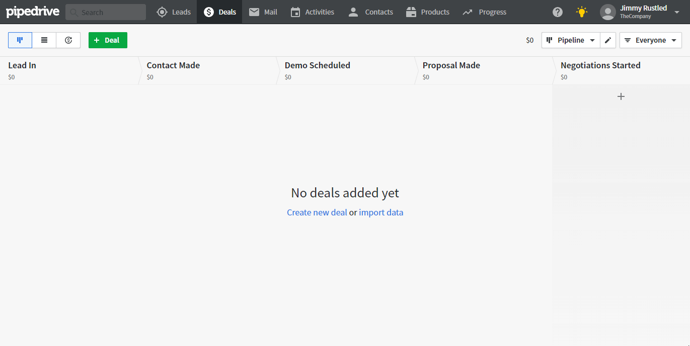

# Pipedrive

You can find information about the operations supported by the Pipedrive node on the [integrations](https://n8n.io/integrations/n8n-nodes-base.pipedrive) page. You can also browse the source code of the node on [GitHub](https://github.com/n8n-io/n8n/tree/master/packages/nodes-base/nodes/Pipedrive).

## Prerequisites

Create a [Pipedrive](https://pipedrive.com/) account.

## Using Access Token

1. Access your Pipedrive Dashboard.
2. Click on your user profile in the top right.
3. Click on settings in the dropdown menu.
4. Click on the API tab.
5. Generate new token.
6. Use the token with your Pipedrive node credentials in n8n.

