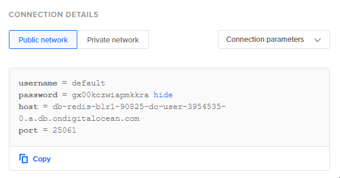

# Redis

You can use these credentials to authenticate the following nodes with Redis.
- [Redis](../../nodes-library/nodes/Redis/README.md)

## Prerequisites

Create an user account on a Redis server. 

## Using Database Connection

1. Retrieve your Redis credentials and connection parameters.
2. Use the credentials and connection parameters with your Redis node credentials in n8n.

