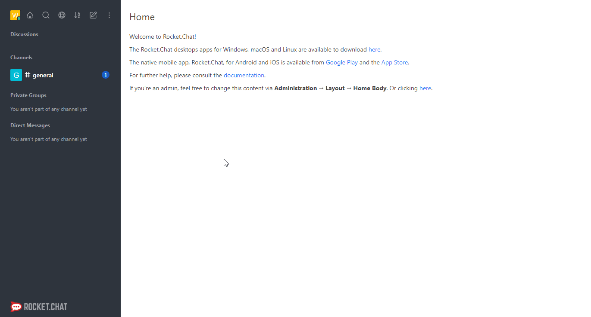

# Rocket.Chat

You can use these credentials to authenticate the following nodes with Rocket.Chat.
- [Rocket.Chat](../../nodes-library/nodes/RocketChat/README.md)

## Prerequisites

- Create a [Rocket.Chat](https://rocket.chat/) account.
- Have the necessary permission `create-personal-access-tokens` (from administrator) to be able to generate personal access tokens.

## Using Access Token

1. Access your Rocket.Chat instance.
2. Click on the profile icon in the top left.
3. Click on My Account.
4. Click on Personal Access Tokens from the panel on the left.
5. Enter a name for your Personal access token and click on the *Add* button.
6. Copy the *Token* and enter that in the *Auth Key* field in n8n.
7. Copy the *User Id* and enter that in the *User Id* field in n8n.

