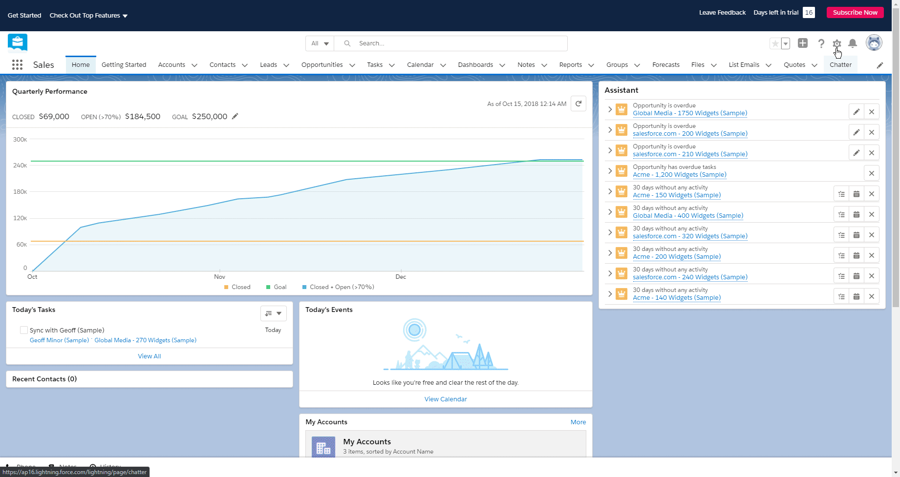

# Salesforce

You can find information about the operations supported by the Salesforce node on the [integrations](https://n8n.io/integrations/n8n-nodes-base.salesforce) page. You can also browse the source code of the node on [GitHub](https://github.com/n8n-io/n8n/tree/master/packages/nodes-base/nodes/Salesforce).

## Prerequisites

Create a [Salesforce](https://www.salesforce.com/) account.

## Using OAuth

1. Access your Salesforce Dashboard.
2. Click on the gear icon in the top right and select ***Setup*** from the dropdown list.
3. In the ***Platform Tools*** category of the sidebar, select ***App Manager*** under the ***Apps*** section.
4. Click on the ***New Connected App*** button.
5. Enter any necessary information and click on the ***Enable OAuth Settings*** checkbox.
6. Copy the ***OAuth Callback URL*** provided in the 'Salesforce OAuth2 API' credentials in n8n.
7. On the Salesforce app creation page, paste the URL in the ***Callback URL*** field.
8. Add any scopes you plan to use in the  ***Selected OAuth Scopes*** section.
8. Click on the ***Save*** button at the bottom of the page.
10. On the ***New Connected App*** page, click on the ***Continue*** button.
11. In the 'API (Enable OAuth Settings)' section of the page, click on the ***Click to reveal*** button to reveal the consumer secret.
12. Copy the displayed ***Consumer Key*** and the ***Consumer Secret*** and use these with your Salesforce OAuth2 API credentials in n8n.
13. Copy the part of the URL between `https://` and `.salesforce.com` and replace 'yourcompany' in the ***Access Token URL*** in your Salesforce OAuth2 API credentials in n8n.
14. Click on the circle button in the OAuth section to connect a Salesforce account to n8n.
15. Click on the ***Save*** button to save your credentials.

