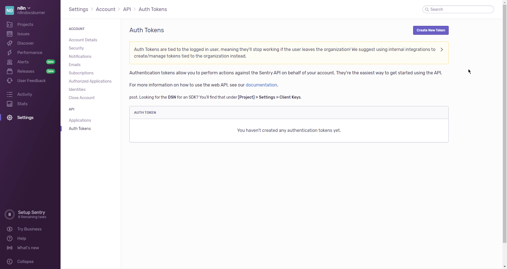

# Sentry.io

You can find information about the operations supported by the Sentry.io node on the [integrations](https://n8n.io/integrations/n8n-nodes-base.sentryIo) page. You can also browse the source code of the node on [GitHub](https://github.com/n8n-io/n8n/tree/master/packages/nodes-base/nodes/SentryIo).

## Prerequisites

Create a [Sentry.io](https://sentry.io/) account.

## Using OAuth

1. Access your [Sentry.io Applications Page](https://sentry.io/settings/account/api/applications/).
2. Click on the ***Create New Application*** button in the top right.
3. Enter a name in the ***Name*** field.
4. Copy the 'OAuth Callback URL' provided in the 'Sentry.io OAuth2 API' credentials in n8n and paste it in the ***Authorized Redirect URIs*** field in the Sentry.io 'Application Details' page.
5. Use the displayed ***Client ID*** and ***Client Secret*** with your Sentry.io OAuth2 API credentials in n8n.
6. Click on the circle button in the OAuth section to connect a Sentry.io account to n8n.
7. Click on the ***Save*** button to save your credentials.

## Using Access Token

1. Access your [Sentry.io Auth Tokens page](https://sentry.io/settings/account/api/auth-tokens/).
2. Click on the ***Create New Token*** button in the top right.
3. Select any scopes you plan to use and then click on ***Create Token***.
4. Use the generated access token with your Sentry.io API credentials in n8n.
5. Click on the ***Save*** button to save your credentials.

