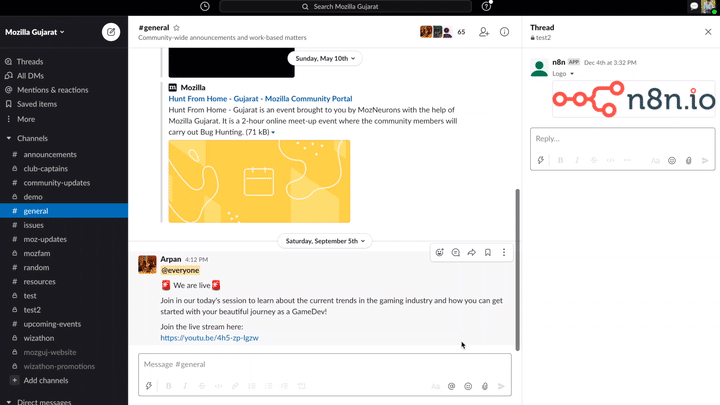

# Slack

You can find information about the operations supported by the Slack node on the [integrations](https://n8n.io/integrations/n8n-nodes-base.slack) page. You can also browse the source code of the node on [GitHub](https://github.com/n8n-io/n8n/tree/master/packages/nodes-base/nodes/Slack).

## Prerequisites

Create a [Slack](https://slack.com/) account.

## Using Access Token

1. Access your Slack dashboard.
2. Click on your username in the top left.
3. Click the Settings & Administration option, and then manage apps.
4. Click on build in the top right which brings you to another page.
5. Click on start building.
6. Enter app name and select your desired workspace.
7. Scroll down and you will see your authentication information.
8. Use your verification token with your Slack node credentials in n8n.

