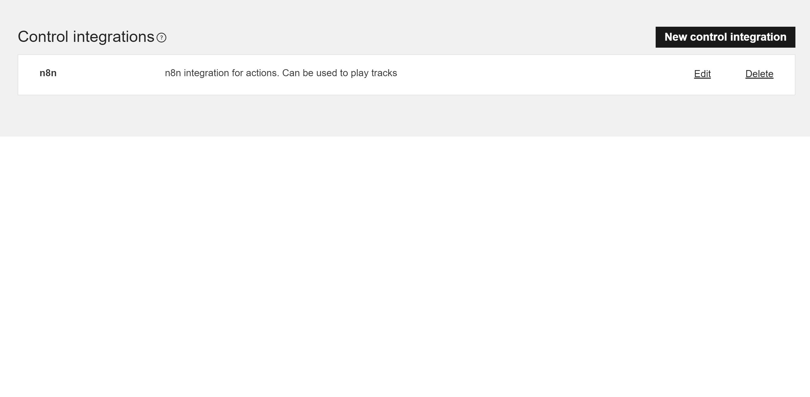

# Sonos

You can use these credentials to authenticate the following nodes with Sonos.
- [Sonos](../../nodes-library/nodes/Sonos/README.md)

## Prerequisites

Create a [Sonos Developer](https://developer.sonos.com/) account.

## Using OAuth

1. Access the [Integrations Overview](https://integration.sonos.com/integrations) page.
2. Hit the ***New control integration*** button.
3. Enter a name in the ***Display name*** field.
4. Enter a description in the ***Description*** field.
5. Press Next.
6. Enter a Key Name and Press Next.
7. Copy the 'OAuth Callback URL' provided in the Sonos API credentials in n8n and paste it in the ***Redirect URI*** field of the *Client Credentials* page of your sonos integration.
8. Click on the ***Save*** button.
9. Use the displayed ***Key*** and the ***Secret*** with your Sonos API credentials in n8n.
10. Click the ***Connect my account*** button and follow the steps in the opened popup in order to authorize your account.
11. After successful authorization you can close the credentials dialog.

