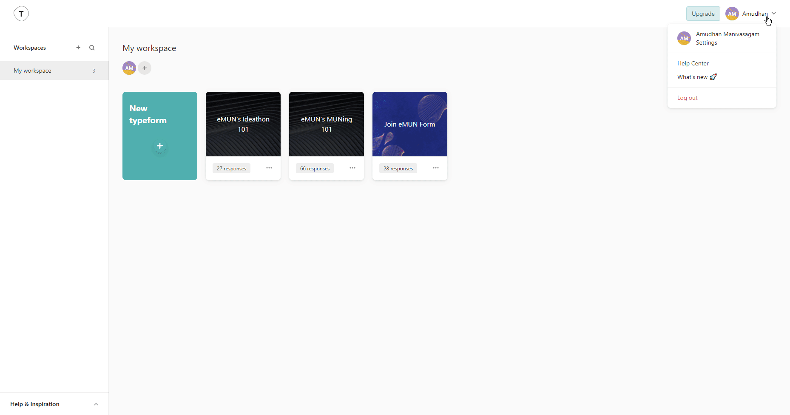

# Typeform

You can use these credentials to authenticate the following nodes with Typeform.
- [Typeform Trigger](../../nodes-library/trigger-nodes/TypeformTrigger/README.md)

## Prerequisites

Create a [Typeform](https://typeform.com/) account.

## Using OAuth

1. Access your Typeform dashboard.
2. Go to your user profile in the top right.
3. Click on 'Settings' and then click on 'Developer apps' in the sidebar.
4. Click on the ***Register a new app*** button.
5. Copy the 'OAuth Callback URL' provided in the Typeform OAuth2 API credentials in n8n and paste it in the ***Redirect URI(s)*** section in the Typeform app registration page.
6. Enter any other information necessary and click on the ***Register app*** button.
7. Use the displayed ***Client ID*** and ***Client secret*** with your Typeform OAuth2 API credentials in n8n.
8. Click on the circle button in the OAuth section to connect a Typeform account to n8n.
9. Click the ***Save*** button to save your credentials.

## Using Access Token

1. Access your Typeform dashboard.
2. Go to your user profile in the top right.
3. Click on 'Settings' and then click on 'Personal tokens' in the sidebar.
4. Click on the ***Generate a new token*** button.
5. Enter a name in the ***Token name*** field and click on the ***Generate token*** button.
6. Use the displayed ***Personal access token*** with your Typeform API credentials in n8n.

