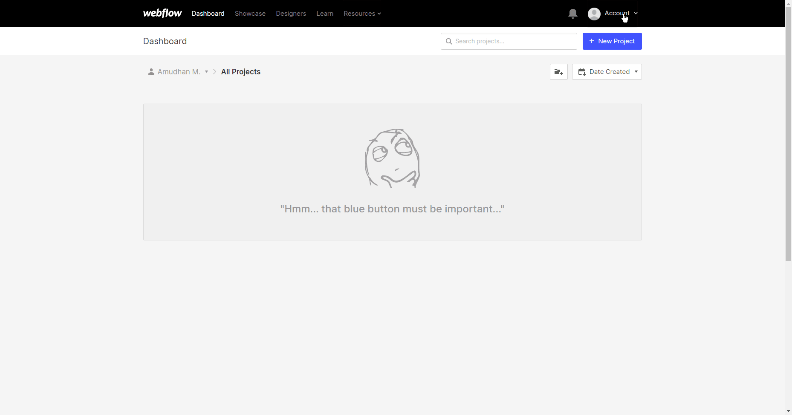

# Webflow

You can use these credentials to authenticate the following nodes with Webflow.
- [Webflow Trigger](../../nodes-library/trigger-nodes/WebflowTrigger/README.md)

## Prerequisites

Create a [Webflow](https://webflow.com/) account.

## Using OAuth

::: tip ⛅️ Note for n8n.cloud users
You'll only need to enter the Credentials Name and click on the circle button in the OAuth section to connect your Webflow account to n8n.
:::

1. Access your Webflow dashboard.
2. Click on 'Account' on the top right corner.
3. Select 'Account Settings' from the dropdown list.
4. Click on the 'Integrations' tab.
5. Click on the ***+ Register New Application*** button in the 'My Applications' section.
6. Enter the name of your application in the ***Application Name*** field.
7. Enter the description of your application in the ***Application Description*** field.
8. Copy the 'OAuth Callback URL' provided in the 'Webflow OAuth2 API' credentials in n8n and paste it in the ***Redirect URI*** field in the Webflow integrations page.
9. Enter the homepage URL of your application in the ***Application Homepage*** field.
10. Click on the ***Create*** button.
11. Click on the ***View Details*** button to get the ***Client Id*** and ***Client Secret***.
12. Use these credentials with your 'Webflow OAuth2 API' credentials in n8n.
13. Click on the circle button in the OAuth section of n8n to connect a Webflow account to n8n.
14. Click on the ***Save*** button to save your credentials.

## Using Access Token

1. Access your Webflow dashboard.
2. Click on your desired project.
3. Click on the W icon in the top left.
4. Click on Project Settings.
5. Click on the Integrations tab.
6. Scroll down and click generate API token.
7. Use the api token with your Webflow node credentials in n8n.

