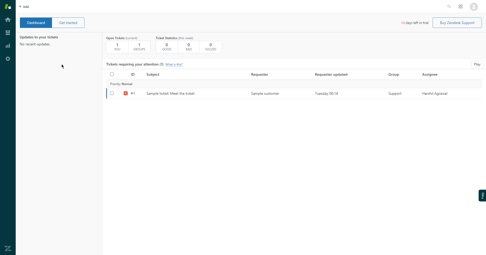
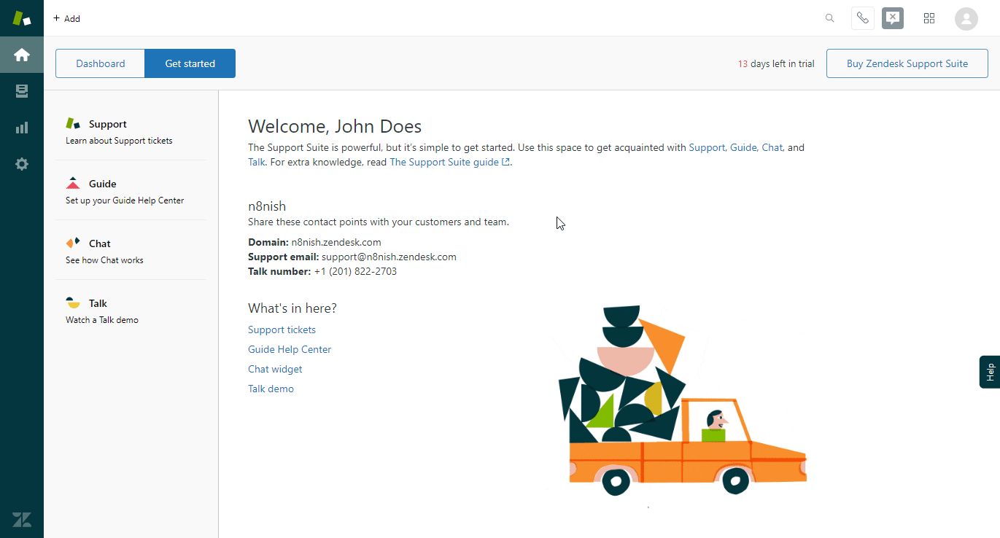

# Zendesk

You can use these credentials to authenticate the following nodes with Zendesk.
- [Zendesk](../../nodes-library/nodes/Zendesk/README.md)
- [Zendesk Trigger](../../nodes-library/trigger-nodes/ZendeskTrigger/README.md)

## Prerequisites

Create a [Zendesk](https://zendesk.com/) account.

## Using OAuth

::: tip ⛅️ Note for n8n.cloud users
You'll only need to enter the Credentials Name and click on the circle button in the OAuth section to connect your Zendesk account to n8n.
:::

1. Access your Zendesk dashboard.
2. Click on the gear icon on the left.
3. Click on API under the ***Channels*** section in the sidebar.
4. Click on the 'OAuth Clients' tab.
5. Enter the client name in the ***Client Name*** field.
6. Enter the description in the ***Description*** field.
7. Copy the 'OAuth Callback URL' provided in the 'Zendesk OAuth2 API' credentials in n8n and paste it in the ***Redirect URLs*** field in the Zendesk API credentials page.
8. Click on the ***Save*** button.
9. Use the displayed ***Secret*** in the 'Zendesk OAuth2 API' credentials in n8n.
10. Enter the client name you used in the Zendesk API credentials page in the ***Client ID*** field in n8n.
11. Click on the circle button in the OAuth section to connect a Zendesk account to n8n.
12. Click on the ***Save*** button to save your credentials.

## Using Access Token

1. Access your Zendesk dashboard.
2. Click on the gear icon on the left.
3. Click on API under the *Channels* section.
4. Click the plus icon under Token Access.
5. Use your Zendesk email, URL and the API token in your Zendesk credentials.

