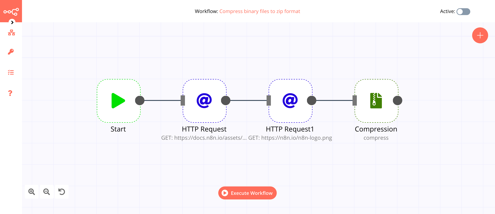
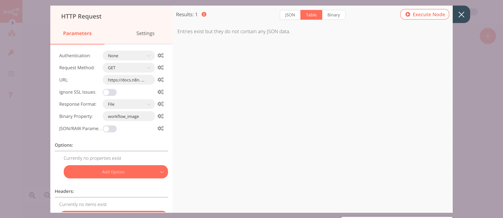
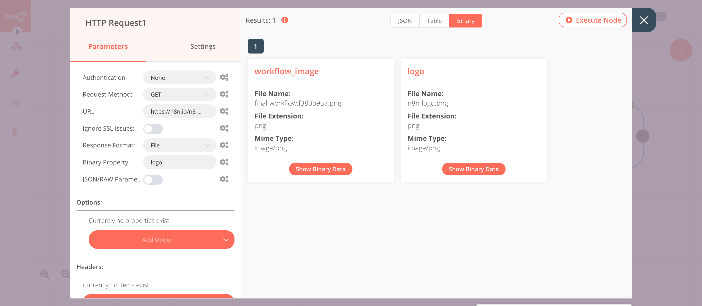
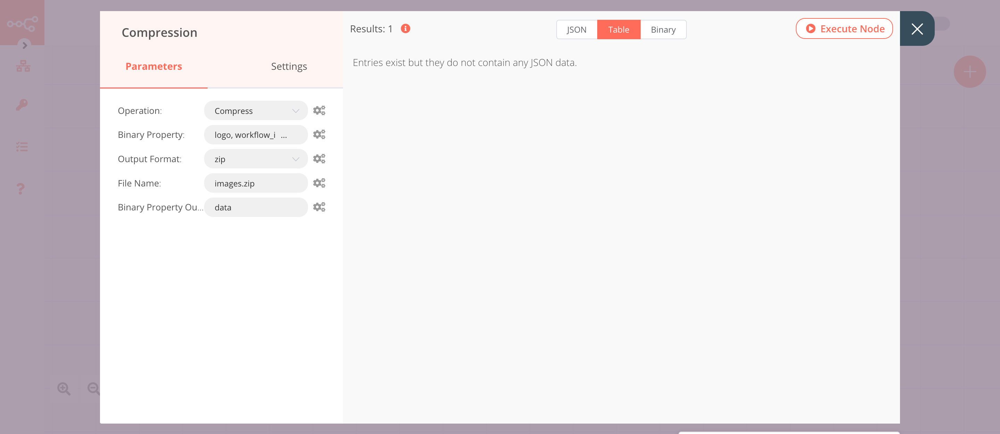

# Compression

The Compression node is useful to compress and decompress files. You can either use the `gzip` or `zip` file format.

## Node Reference

- Operations
	- Compress
	- Decompress
- Options
    - ***Binary Property*** field: This field allows you to specify the name of the binary property
    - ***Output Prefix*** field: This field allows you to specify a prefix for the name of the file that gets generated. This field gets displayed for the 'Decompress' operation and the 'gzip' output format for the 'Compress' operation
    - ***Output Format*** field: This field allows you to select an output format. This field is displayed when 'Compress' gets selected from the ***Operation*** dropdown list. The following are the available formats:
        - gzip
        - zip
    - ***File Name*** field: This field allows you to specify a file name. This field is displayed when 'zip' gets selected from the ***Output Format*** dropdown list.
    - ***Binary Property Output*** field: This field allows you to specify a name for the file that gets generated. This field is displayed when 'zip' gets selected from the ***Output Format*** dropdown list.

## Example Usage

This workflow allows you to compress binary files to zip format and upload them to Dropbox. You can also find the [workflow](https://n8n.io/workflows/908) on n8n.io. This example usage workflow would use the following nodes.
- [Start](../../core-nodes/Start/README.md)
- [HTTP Request](../../core-nodes/HTTPRequest/README.md)
- [Compression]()
- [Dropbox](../../nodes/Dropbox/README.md)

The final workflow should look like the following image.

### 1. Start node

The start node exists by default when you create a new workflow.

### 2. HTTP Request node (GET)

This example workflow uses the HTTP Request node to fetch an image from a URL. You can also use the [Read Binary File](../../core-nodes/ReadBinaryFile/README.md) node to read a file from the path you specify.

1. Enter the URL of the image in the ***URL*** field. For example, `https://docs.n8n.io/assets/img/final-workflow.f380b957.png`.
2. Select 'File' from the ***Response Format*** dropdown list.
3. Enter `workflow_image` in the ***Binary Property*** field.
4. Click on ***Execute Node*** to run the node.

In the screenshot below, you will notice that the HTTP Request node fetches the image from the URL. This image gets passed on as binary data to the next node in the workflow.

### 3. HTTP Request1 node (GET)

This node fetches an image from a URL. You can also use the [Read Binary File](../../core-nodes/ReadBinaryFile/README.md) node to read a file from the path you specify.

1. Enter the URL of the image in the ***URL*** field. For example, `https://n8n.io/n8n-logo.png`.
2. Select 'File' from the ***Response Format*** dropdown list.
3. Enter `logo` in the ***Binary Property*** field.
4. Click on ***Execute Node*** to run the node.

In the screenshot below, you will notice that the HTTP Request node fetches the image from the URL. This image gets passed on as binary data to the next node in the workflow.

### 4. Compression node (compress)

This node compresses the binary file that we received from the HTTP Request nodes in a zip file. If you want to compress them in `gzip` format, select that option instead.

1. Select 'Compress' from the ***Operation*** dropdown list.
2. Enter `logo,workflow_image` in the ***Binary Property*** field.
3. Select 'zip' from the ***Output Format*** dropdown list.
4. Enter `images.zip` in the ***File Name*** field.
5. Click on ***Execute Node*** to run the node.

In the screenshot below, you will notice that the node compresses the files and generates `images.zip`.

### 5. Dropbox node (upload: file)

This node will upload the compressed file to your Dropbox account.

1. First of all, you'll have to enter credentials for the Dropbox node. You can find out how to do that [here](../../../credentials/Dropbox/README.md).
2. Enter `/images.zip` in the ***File Path*** field.
3. Toggle ***Binary Data*** to `true`. This option allows us to upload binary data from the previous node.
4. Click on ***Execute Node*** to run the node.

In the screenshot below, you will notice that the node uploads the compressed file that we generated in the previous node.

