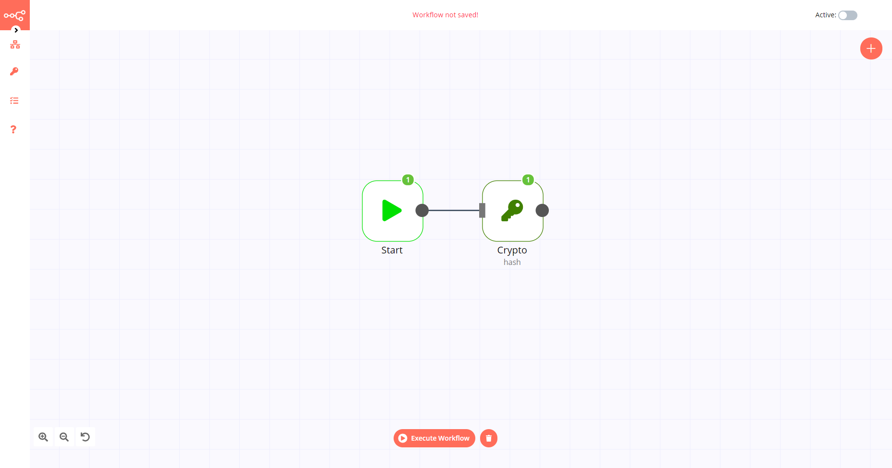

# Crypto

The Crypto node is used to encrypt data in workflows.

## Node Reference

You can configure further options for each action by selecting the type of encryption and encoding to be used, in the *Type* and *Encoding* fields respectively.

- Action
	- Hash a text in a specified format
	- Hmac a text in a specified format
	- Sign a string using a private key
- Type
    - MD5
    - SHA256
    - SHA512
- Encoding
	- BASE64
	- HEX

## Example Usage

This workflow allows you to encrypt data using the Crypto node. You can also find the [workflow](https://n8n.io/workflows/574) on the website. This example usage workflow would use the following two nodes.
- [Start](../../core-nodes/Start/README.md)
- [Crypto]()

The final workflow should look like the following image.

### 1. Start node

The start node exists by default when you create a new workflow.

### 2. Crypto node

1. Enter the data that you want to encrypt in the *Value* field.
2. Click on *Execute Node* to run the workflow.
