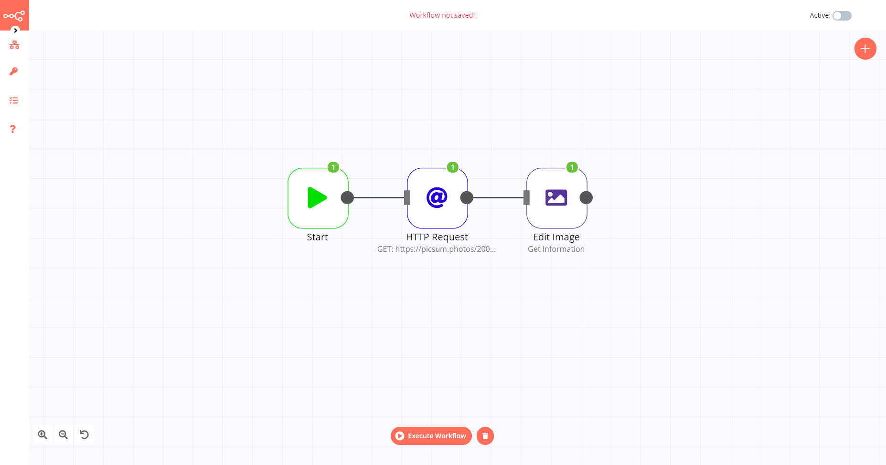

# Edit Image

The Edit Image node is used to manipulate and edit images.

::: tip 💡 Keep in mind
1. You will need to use an additional node such as the [Read Binary File](../../core-nodes/ReadBinaryFile/README.md) node or the [HTTP Request](../../core-nodes/HTTPRequest/README.md) node to pass the image file as a data property to the Edit Image node.
:::

## Node Reference

- Operations
	- Add a blur to the image to reduce sharpness
	- Add a border to the image
	- Crop the image
	- Get information about the image
	- Rotate the image
	- Change the size of the image
	- Add text to the image

You can also specify a file format using the *Format* field in the *Add Option* dropdown list.

**Options**
- **File Name**: Allows you to specify the filename of the output file.
- **Format**: Allows you to specify the image format of the output file:
	- BMP
	- GIF
	- JPEG
	- PNG
	- TIFF

## Example Usage

This workflow allows you to get information about an image downloaded from the internet using the Edit Image node. You can also find the [workflow](https://n8n.io/workflows/576) on the website. This example usage workflow would use the following three nodes.
- [Start](../../core-nodes/Start/README.md)
- [HTTP Request](../../core-nodes/HTTPRequest/README.md)
- [Edit Image]()

The final workflow should look like the following image.

### 1. Start node

The start node exists by default when you create a new workflow.

### 2. HTTP Request node

1. Enter `https://picsum.photos/200/300` in the *URL* field.
2. Select 'File' from the *Response Format* dropdown list.

### 3. Edit Image node

1. Select 'Get Information' from the *Operation* dropdown list.
2. Click on *Execute Node* to run the workflow.
