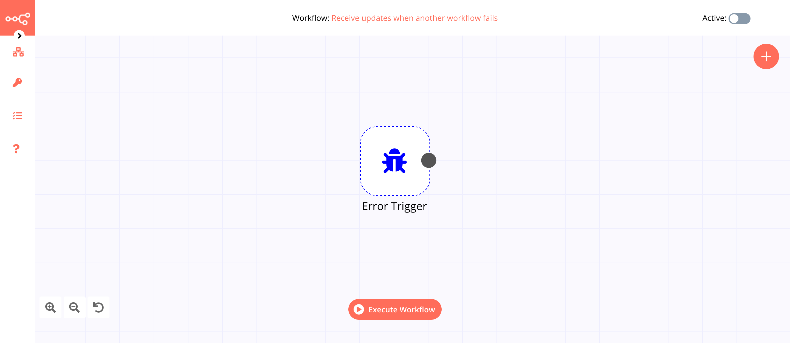

# Error Trigger

The Error Trigger node triggers a workflow when another workflow has an error. Once a workflow fails, this node gets details about the failed workflow and the errors. This triggers the error workflow.

::: tip 💡 Keep in mind
1. If a workflow is using the Error Trigger node, you don't have to activate the workflow.
2. If you want to receive error messages for a workflow, make sure that you select the 'Error Workflow' in the ***Workflow Settings*** for the workflow.
3. If a workflow is using the Error Trigger node, by default, the workflow will use itself as the Error Workflow.
:::

## Example Usage

This workflow allows you to send an SMS when a workflow fails. You can also find the [workflow](https://n8n.io/workflows/665) on n8n.io. This example usage workflow would use the following nodes.
- [Error Trigger]()
- [Twilio](../../../nodes-library/nodes/Twilio/README.md)

The final workflow should look like the following image.

### 1. Error Trigger node

This node will execute when an error occurs.

### 2. Twilio node (send: sms)

1. First of all, you'll have to enter credentials for the Twilio node. You can find out how to do that [here](../../../credentials/Twilio/README.md).
2. Enter the Twilio phone number in the ***From*** field.
3. Enter the receiver's phone number in the ***To*** field.
4. Click on the gears icon next to the ***Message*** field and click on ***Add Expression***.
::: v-pre
5. Enter `Your workflow with ID: {{$node["Error Trigger"].json["workflow"]["id"]}} and name: {{$node["Error Trigger"].json["workflow"]["name"]}} failed to execute.` in the ***Expression*** field.
6. The node will execute when the Error Trigger node is triggered.
:::

## FAQs

### How to set an error workflow for an n8n workflow?

Let's say we want to get a notification every time **Workflow A** fails. Create a new workflow, **Workflow B**. Add an Error Trigger node and set **Workflow B** as the error workflow for **Workflow A** by following these steps.
- Open **Workflow A**.
- Click on ***Workflows*** in the left menu and select 'Settings' from the dropdown list.
- Select **Workflow B** from the ***Error Workflow*** dropdown list.
- Click on the ***Save*** button.

### Can we send a custom error message?

The Error Trigger node sends the actual error message thrown by the workflow. You can use this information as shown in the [Example Usage](#example-usage) section as well as send a custom error message like in the Twilio node. However, you cannot send a custom error message to the Error Trigger node.

### How do we call the Error Workflow manually?

There is currently no functionality to call an Error Workflow manually.

## Further Reading

<FurtherReadingBlog />
