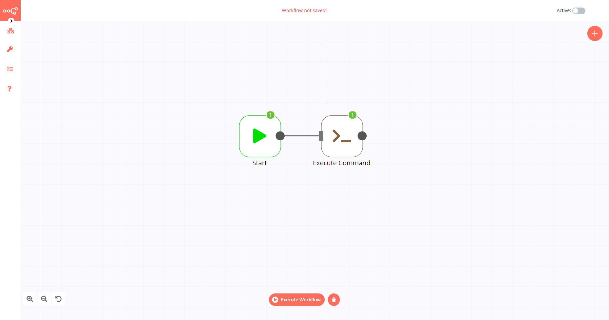
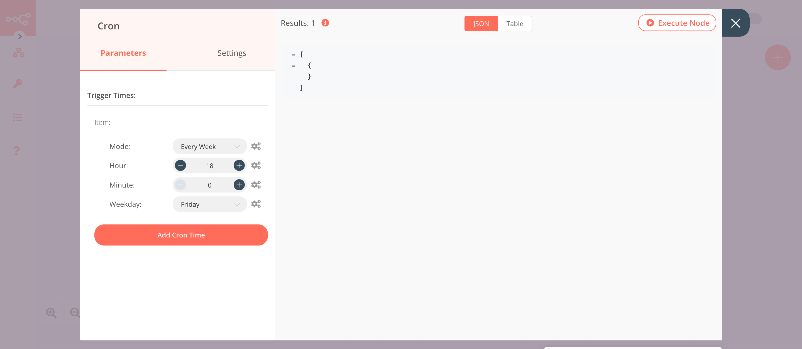
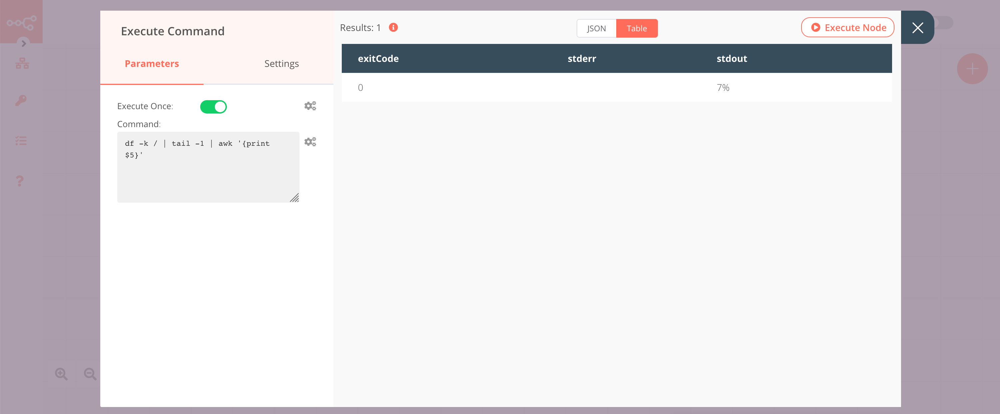
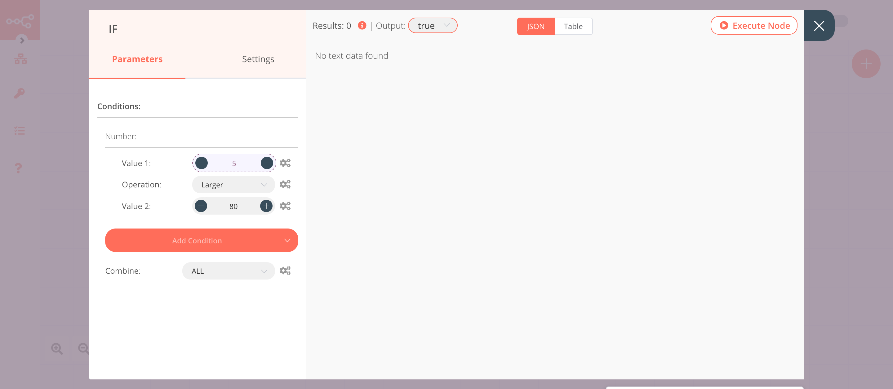
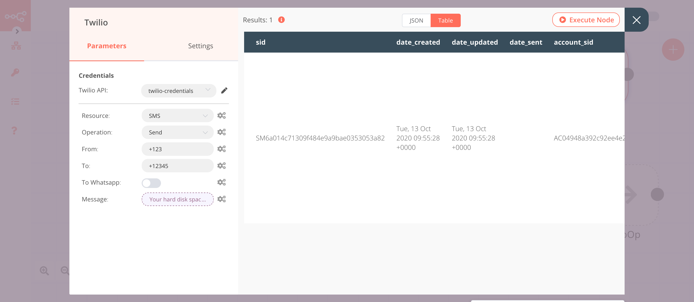
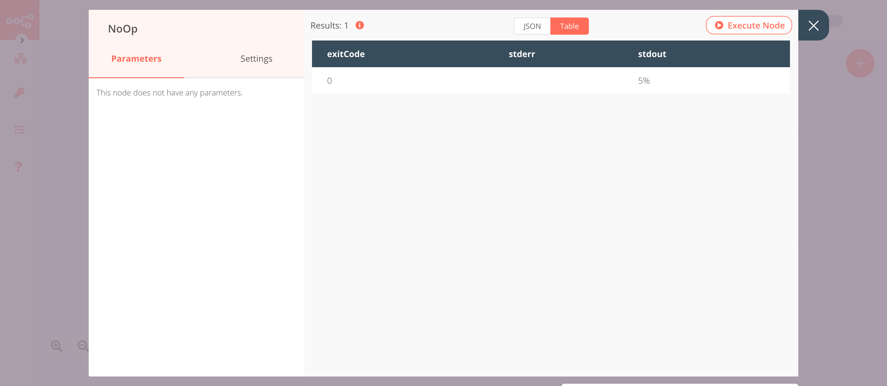

# Execute Command

The Execute Command node is used to run shell commands on the host machine that runs n8n.

::: tip 💡 Keep in mind
1. If you are running n8n in Docker, your command will run on the n8n container and not the Docker host.
2. This node will execute the command in the default shell of the host machine. For example, this will be PowerShell on Windows and zsh on macOS.
:::

## Node Reference

The Execute Command node has two properties:
1. *Execute Once* toggle: This is a boolean field that is used to specify whether you want the node to execute only once, or once for every item it receives an input.
2. *Command* field: This is a text field that is used to specify the command that will be executed on the host machine.


## Example Usage

This workflow allows you to execute a command that returns the percentage of the memory used by the hard disk of the host machine using the Execute Command node. If the percentage of memory used exceeds 80%, the workflow will send an SMS using the Twilio node. You can also find the [workflow](https://n8n.io/workflows/716) on the website. This example usage workflow would use the following nodes.
- [Cron](../../core-nodes/Cron/README.md)
- [Execute Command]()
- [IF](../../core-nodes/If/README.md)
- [Twilio](../../nodes/Twilio/README.md)
- [No Operation, do nothing](../../core-nodes/NoOperationDoNothing/README.md)


The final workflow should look like the following image.



### 1. Cron node

The Cron node will trigger the workflow twice a day.

1. Click on ***Add Cron Time***.
2. Select 'Every Day' from the ***Mode*** dropdown list.
3. Set hours to 9 in the ***Hour*** field.
4. Click on ***Add Cron Time***.
5. Select 'Every Day' from the ***Mode*** dropdown list.
6. Set hours to 16 in the ***Hour*** field.
7. Click on ***Execute Node*** to run the node.



::: v-pre
### 2. Execute Command node

The Execute Command node will execute the command and return the hard disk space used on the host machine.

1. Enter the command `df -k / | tail -1 | awk '{print $5}'` in the ***Command*** field.
2. Click on ***Execute Node*** to run the node.
:::

In the screenshot below, you will notice that the node executes the command and returns the amount of hard disk memory used by the host machine.



::: v-pre
### 3. IF node

This node will compare the percentage of the hard disk space used we got from the Execute Command node. If the percentage of the memory used exceeds 80%, it will return true otherwise false.

1. Click on ***Add Condition*** and select 'Number' from the dropdown list.
2. Click on the gears icon next to the ***Value 1*** field and click on ***Add Expression***.
3. Enter `{{parseInt($node["Execute Command"].json["stdout"])}}` in the ***Expression*** field. The output from the Execute Command node is a string. The `parseInt()` method converts the string into an integer.
4. Select 'Larger' from the ***Operation*** dropdown list.
5. Set ***Value 2*** to 80.
5. Click on ***Execute Node*** to run the node.
:::

In the screenshot below, you will notice that the node returns an output when the percentage of hard disk space used exceeds 80%.



### 4. Twilio node (send: sms)

This node sends an SMS to a number when the percentage of hard disk space used exceeds 80%.

1. First of all, you'll have to enter credentials for the Twilio node. You can find out how to do that [here](../../../credentials/Twilio/README.md).
2. Enter the Twilio phone number in the ***From*** field.
3. Enter the receiver's phone number in the ***To*** field.
4. Click on the gears icon next to the ***Message*** field and click on ***Add Expression***.
::: v-pre
5. Enter `Your hard disk space is filling up fast! Your hard disk is {{$node["Execute Command"].json["stdout"]}} filled.` in the ***Expression*** field.
6. Click on ***Execute Node*** to run the node.
:::

In the screenshot below, you will notice that the node sends an SMS with the percentage of the hard disk space used we got from the Execute Command node.



### 5. NoOp node
Adding this node here is optional, as the absence of this node won't make a difference to the functioning of the workflow.

1. Create a ***NoOp*** node connected to the 'false' output of the IF node.
2. Click on ***Execute Node*** to run the node.



## FAQs

### How to run multiple commands in the Execute Command node?
You can combine multiple commands using `&&`. For example, you can combine the change directory(cd) command with the list(ls) command using `&&`.
```bash
cd bin && ls
```

To run multiple commands, you can also write the commands on separate lines. For example, you can write the list(ls) command on a new line after the change directory(cd) command.
```bash
cd bin
ls
```

### How to run the curl command in the Execute Command node?

You should use the [HTTP Request](../../core-nodes/HTTPRequest/README.md) node to make a CURL request.

If you want to run the curl command in the Execute Command node, you will have to build a Docker image based on the existing n8n image. The default n8n Docker image uses Alpine Linux. You will have to install the curl package. 
1. Create a file named Dockerfile.
2. Add the below code snippet to the Dockerfile.
```
FROM n8nio/n8n
RUN apk --update add curl
```
3. In the same folder, execute the command below command to build the Docker image.
```
docker build -t n8n-curl
```
4. Replace the Docker image you used before. For example, replace `n8nio/n8n` with `n8n-curl`.
5. Run the newly created Docker image, and you will now be able to execute ssh via the Execute Command-Node.
