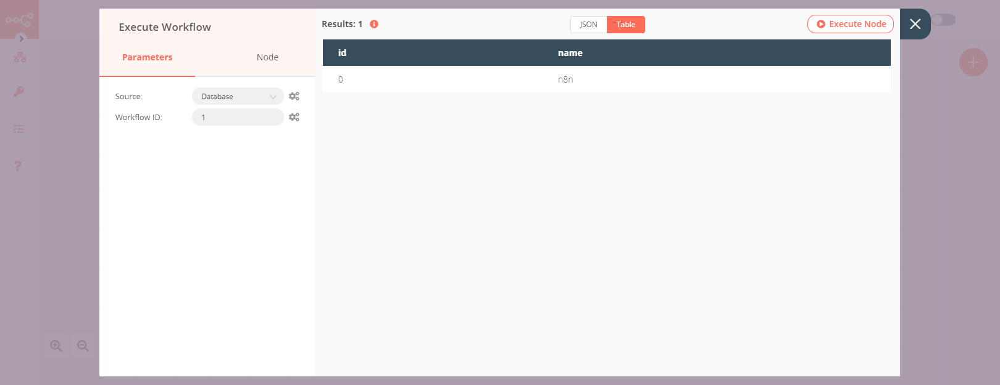

# Execute Workflow

The Execute Workflow node is used to run a different workflow on the host machine that runs n8n.

The Execute Workflow node has two properties:
1. ***Source*** field: This is a text field used to specify from where to get the workflow's information.

- Source
	- Database
	- Local File
	- Parameter
	- URL

2. ***Workflow*** field: This is a text field that contains information about the workflow, such as the workflow ID, JSON, URL or file.

## Example Usage

This workflow allows you to execute another workflow on the host machine using the Execute Workflow node. You can also find the [workflow](https://n8n.io/workflows/588) on the website. This example usage workflow would use the following nodes.
- [Start](../../core-nodes/Start/README.md)
- [Execute Workflow]()

The final workflow should look like the following image.

### 1. Start node

The start node exists by default when you create a new workflow.

### 2. Execute Workflow node

1. Enter the ID of the workflow that you want to execute in the ***Workflow ID*** field.
2. Click on ***Execute Node*** to run the workflow.

