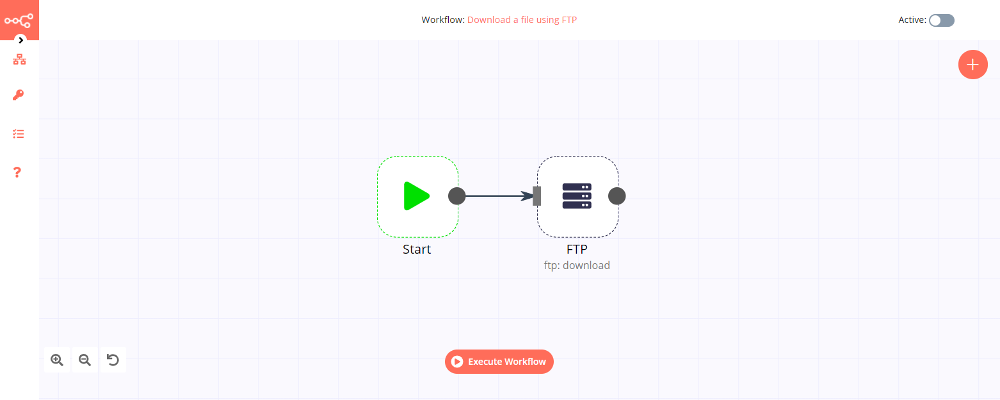

# FTP

The FTP node is useful to access and upload files to an FTP server.

::: tip 🔑 Credential
You can find authentication information for this node [here](../../../credentials/FTP/README.md).
:::

## Basic Operations

- Download a file
- List contents of a folder
- Upload a file

**Note:** To attach a file for upload, you will need to use an additional node such as the [Read Binary File](../../core-nodes/ReadBinaryFile/README.md) node or the [HTTP Request](../../core-nodes/HTTPRequest/README.md) node to pass the file as a data property.

## Node Reference

- ***Protocol:*** A dropdown list to choose between the FTP or SFTP protocol.
- ***Path:*** A field used to specify the remote path that you would like to connect to.
- ***Recursive:*** A toggle that can be used to include all subdirectories and files.

## Example Usage

This workflow allows you to download a file from an FTP server using the FTP node. You can also find the [workflow](https://n8n.io/workflows/663) on n8n.io. This example usage workflow would use the following nodes.
- [Start](../../core-nodes/Start/README.md)
- [FTP]()

The final workflow should look like the following image.

### 1. Start node

The start node exists by default when you create a new workflow.

### 2. FTP node (ftp: download)

1. First of all, you'll have to enter credentials for the Send Email node. You can find out how to do that [here](../../../credentials/FTP/README.md).
2. Enter the path of the file you want to download in the ***Path*** field.
3. Click on ***Execute Node*** to run the workflow.
