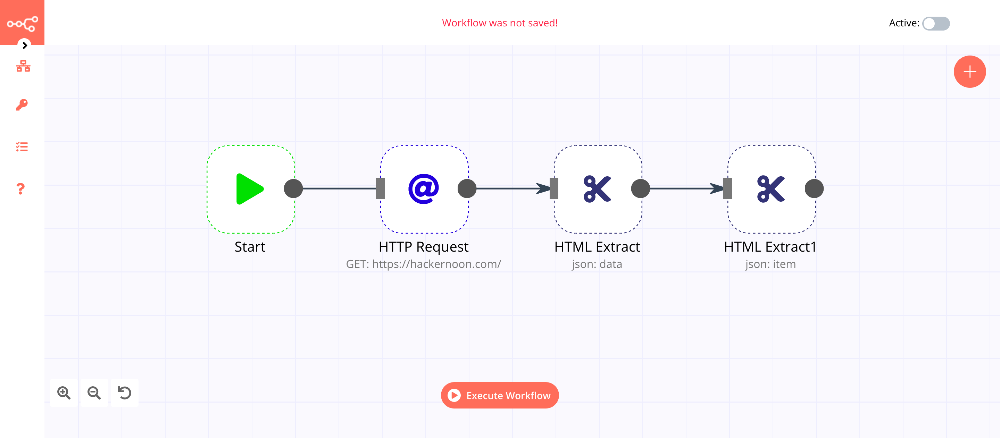
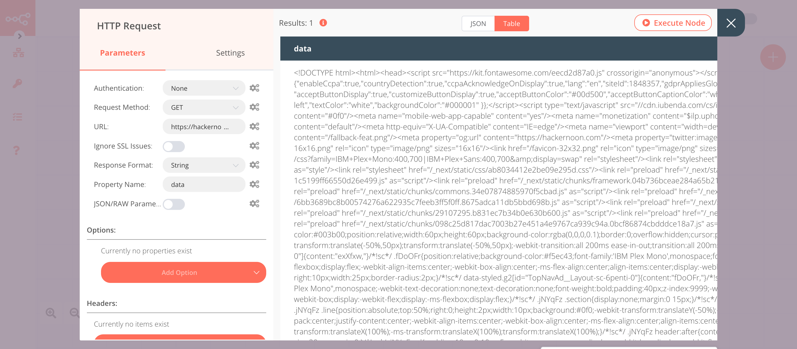
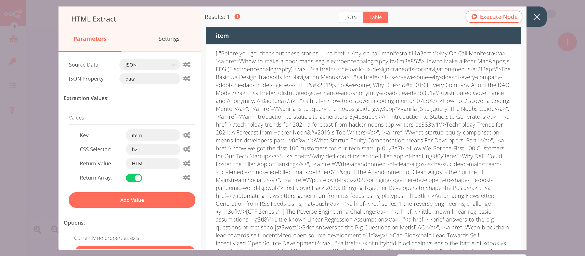
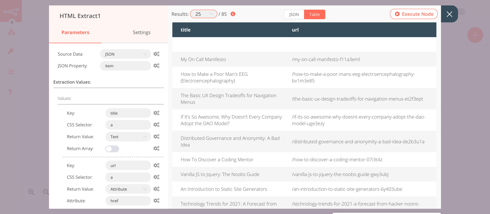

# HTML Extract

The HTML Extract node is useful to extract the HTML content of a webpage.

## Node Reference

- **Source Data:** This field specifies if HTML should be read from binary or JSON data. In this dropdown list, there are two options.
	- Binary
	- JSON
- ***JSON Property:*** The name of the JSON property in which the HTML (from which to extract the data) can be found. This field is displayed when 'JSON' is selected in the ***Source Data*** field.
- ***Binary Property:*** The name of the binary property in which the HTML (from which to extract the data) can be found. This field is displayed when 'Binary' is selected in the ***Source Data*** field.
The property can either contain a string or an array of strings.
- ***Extraction Values:***
	- ***Key:*** The key under which the extracted value should be saved.
	- ***CSS Selector:*** The CSS selector to use.
	- ***Return Value:*** The kind of data that should be returned. In this dropdown list there are four options.
		- ***Attribute:*** Get an attribute value like 'class' from an element.
			- ***Attribute:*** The name of the attribute to return the value of.
		- ***HTML:*** Get the HTML that the element contains.
		- ***Text:*** Get only the text content of the element.
		- ***Value:*** Get the value of an input, select, or textarea.
	- ***Return Array:*** Returns the values as an array so that if multiple ones are found, they also get returned separately. If not set, all values will be returned as a single string.
- ***Options:***
	- ***Trim Values:*** Removes all spaces and newlines from the beginning and end of the values.

## Example Usage

This workflow allows you to extract titles and URLs of all the articles from the  [Hackernoon](https://hackernoon.com/) homepage using the HTML Extract node. You can also find the [workflow](https://n8n.io/workflows/434) on n8n.io. This example usage workflow uses the following nodes.
- [Start](../../core-nodes/Start/README.md)
- [HTTP Request](../../core-nodes/HTTPRequest/README.md)
- [HTML Extract]()

The final workflow should look like the following image.

### 1. Start node

The start node exists by default when you create a new workflow.

### 2. HTTP Request node (GET)

1. Enter `https://hackernoon.com` in the ***URL*** field.
2. Select 'String' from the ***Response Format*** dropdown list.
2. Click on ***Execute Node*** to run the node.

### 3. HTML Extract node (json: data)

1. Click on the ***Add Value*** button.
2. Enter `item` in the ***Key*** field.
3. Enter `h2` in the ***CSS Selector*** field.
4. Select 'HTML' from the ***Return Value*** dropdown list.
5. Toggle ***Return Array*** to true.
6. Click on ***Execute Node*** to run the node.

### 4. HTML Extract1 node (json: item)

1. Enter `item` in the ***JSON Property*** field.
2. Click on the ***Add Value*** button.
3. Enter `title` in the ***Key*** field.
4. Enter `a` in the ***CSS Selector*** field.
5. Click on the ***Add Value*** button.
6. Enter `url` in the ***Key*** field.
7. Enter `a` in the ***CSS Selector*** field.
8. Select 'Attribute' from the ***Return Value*** dropdown list.
9. Enter `href` in the ***Attribute*** field.
10. Click on ***Execute Node*** to run the node.

## Further Reading

<FurtherReadingBlog />
