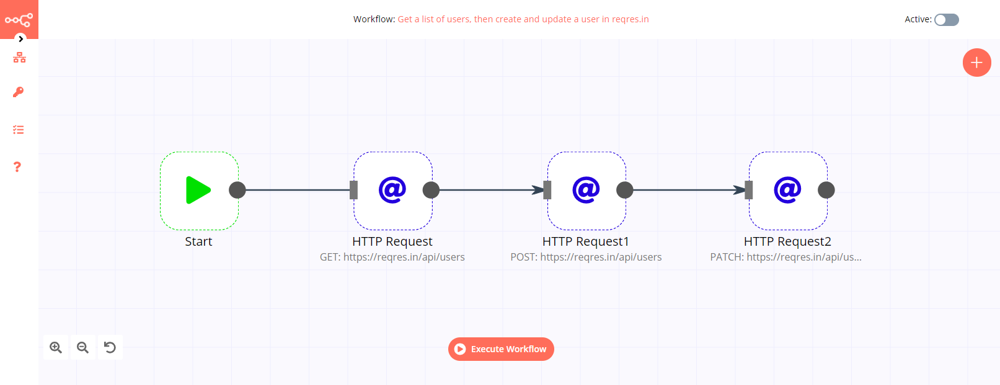
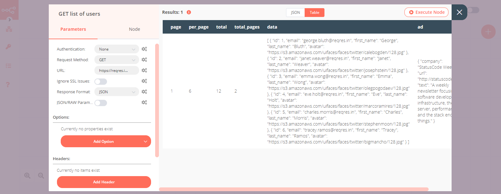
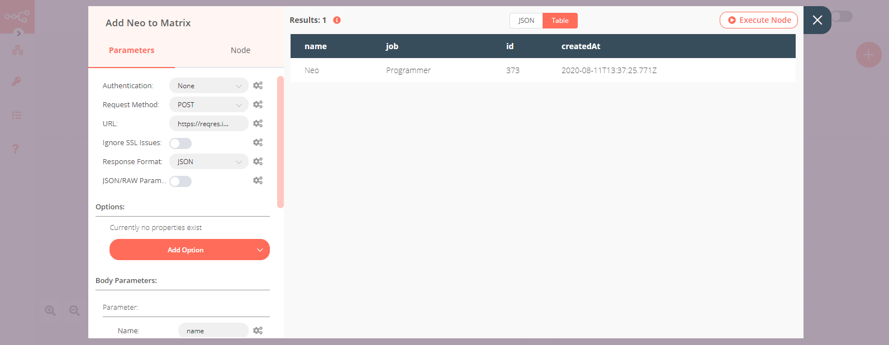
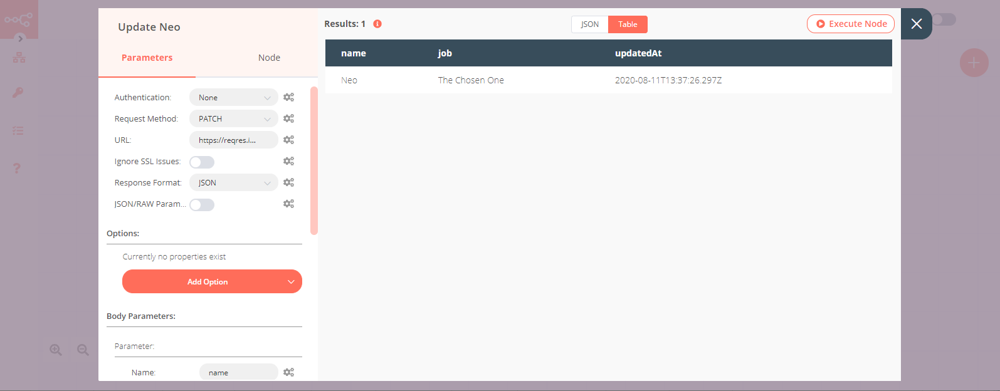

# HTTP Request

The HTTP Request node is one of the most versatile nodes in n8n. It allows you to make HTTP requests which can be used to query data from apps and services.

## Node Reference

- **Authentication:** In this dropdown list, we have several authentication options to use with HTTP requests.
	- Basic Auth
	- Digest Auth
	- Header Auth
	- OAuth1
	- OAuth2
	- None
- **Request Method:** In this dropdown list, we have several methods that can be used to send different type of HTTP requests.
	- DELETE
	- GET
	- HEAD
	- PATCH
	- POST
	- PUT
- **URL:** This is a text field where the HTTP endpoint address has to be entered.
- **Response Format:** Select the format in which the data gets returned from the URL. You can choose between File, JSON, and String.
- **JSON/RAW Parameters:** This defines whether or not you will use n8n's interface to send a payload to the URL or use a json.
- **Options**
	- **Full Response:** This option can be used to retrieve the full response instead of only the body from the URL.
	- **Follow Redirect:** This option can be used to follow any redirections with a status code 3xx.
	- **Ignore Response Code:** This option can be used to let the node execute even when the HTTP status code is not 2xx.
	- **Proxy:** This field is used to specify a HTTP proxy that you may want to use.
	- **Timeout:** The maximum time (in ms) to wait for a response header from the server before aborting the request.
	- **Headers:** This section is used to specify any optional HTTP request headers you may want to include with your request.
	- **Query Parameters:** This section is used to specify any HTTP query parameters you may want to include with your request.

## Example Usage

This workflow allows you to GET a sample list of users from [reqres.in](https://reqres.in/), add a new user using a POST request, and update the user using a PATCH request. You can also find the [workflow](https://n8n.io/workflows/602) on the website. This example usage workflow uses the following two nodes.
- [Start](../../core-nodes/Start/README.md)
- [HTTP Request]()

The final workflow should look like the following image.

### 1. Start node

The start node exists by default when you create a new workflow.

### 2. HTTP Request node (GET)

1. Enter `https://reqres.in/api/users` in the ***URL*** field.
2. Click on ***Execute Node*** to run the workflow.

### 3. HTTP Request node (POST)

1. Select 'POST' from the ***Request Method*** dropdown list.
2. Enter `https://reqres.in/api/users` in the ***URL*** field.
3. Click on the ***Add Parameter*** button in the *Body Parameters* section.
4. Enter `name` in the ***Name*** field.
5. Enter `Neo` in the ***Value*** field.
6. Click on the ***Add Parameter*** button in the *Body Parameters* section.
7. Enter `job` in the ***Name*** field.
8. Enter `Programmer` in the ***Value*** field.
9. Click on ***Execute Node*** to run the workflow.

### 4. HTTP Request node (PATCH)

1. Select 'PATCH' from the ***Request Method*** dropdown list.
2. Enter `https://reqres.in/api/users/2` in the ***URL*** field.
3. Click on the ***Add Parameter*** button in the *Body Parameters* section.
4. Enter `name` in the ***Name*** field.
5. Enter `Neo` in the ***Value*** field.
6. Click on the ***Add Parameter*** button in the *Body Parameters* section.
7. Enter `job` in the ***Name*** field.
8. Enter `The Chosen One` in the ***Value*** field.
9. Click on ***Execute Node*** to run the workflow.

## Further Reading

- [Creating scheduled text affirmations with n8n 🤟](https://medium.com/n8n-io/creating-scheduled-text-affirmations-with-n8n-1c4189efae19)
- [Cross-posting content automatically with n8n ✍️](https://medium.com/n8n-io/automating-cross-posting-blog-posts-using-n8n-%EF%B8%8F-af2a89601810)
- [HTTP Request Node — The Swiss Army Knife](https://medium.com/n8n-io/http-request-node-the-swiss-army-knife-b14e22283383)
