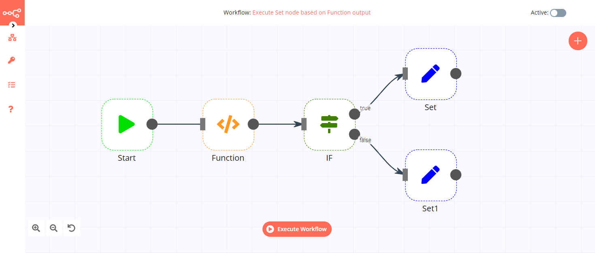
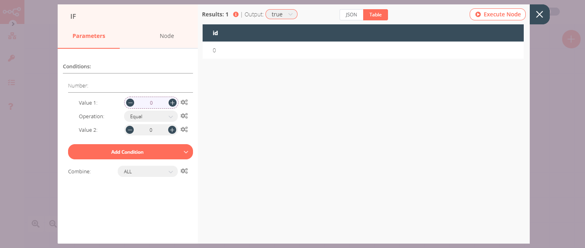
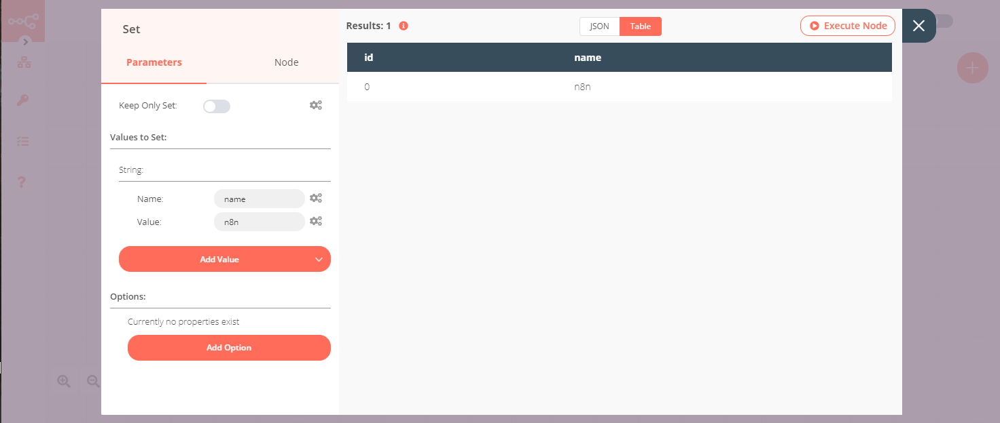

# IF

The IF node is used to split a workflow conditionally based on comparison operations.

## Node Reference

You can choose to split a workflow when any of the specified conditions are met, or only when all the specified conditions are met using the options in the ***Combine*** dropdown list.

You can also add comparison conditions using the ***Add Condition*** dropdown. Conditions can be created based on the data type, the available comparison operations vary for each data type.

- Boolean
	- Equal
	- Not Equal
- Number
	- Smaller
	- Smaller Equal
	- Equal
	- Not Equal
	- Larger
	- Larger Equal
- String
	- Contains
	- Equal
	- Not Contains
	- Not Equal
	- Regex

## Example Usage

This workflow executes two different Set nodes based on the output given by the Function node. You can also find the [workflow](https://n8n.io/workflows/581) on the website. This example usage workflow would use the following four nodes.
- [Start](../../core-nodes/Start/README.md)
- [Function](../../core-nodes/Function/README.md)
- [IF]()
- [Set](../../core-nodes/Set/README.md)


The final workflow should look like the following image.



### 1. Start node

The start node exists by default when you create a new workflow.

### 2. Function node

1. Enter the following in the ***Function*** field.
```
return [
  {
    json: {
      id: 0,
    }
  },
  {
    json: {
      id: 1,
    }
  }
];
```
2. Click on ***Execute Node*** to run the workflow.


### 2. IF node

1. Click on the ***Add Condition*** button and select 'Number' from the dropdown list.
2. In the ***Value 1*** field, use the variable selector to select the output of the previous node.
3. In the ***Value 2*** field, enter '0'.
4. In the ***Operation*** dropdown list, select 'Equal'.
5. Click on ***Execute Node*** to run the workflow.



### 3. Set node (for 'true' condition)

1. Create a Set node connected to the 'true' output of the IF node.
2. Click on the Add Value button and select 'String' from the dropdown list.
3. Enter `name` in the ***Name*** field.
4. Enter `n8n` in the ***Value*** field.
5. Click on ***Execute Node*** to run the workflow.



### 3. Set node (for 'false' condition)

1. Create a Set node connected to the 'false' output of the IF node.
2. Click on the Add Value button and select 'String' from the dropdown list.
3. Enter `name` in the ***Name*** field.
4. Enter `nodemation` in the ***Value*** field.
5. Click on ***Execute Node*** to run the workflow.


