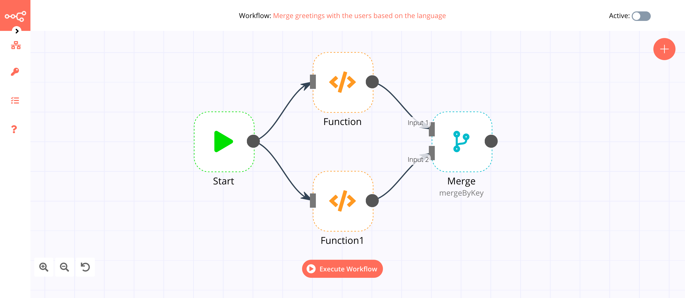

# Merge

The Merge node is useful to merge data of multiple streams, once data of both streams are available.

## Node Reference

- **Mode:** You can specify how data of branches should be merged. The following are the options.
    - ***Append:*** Combines data of both inputs. The output will contain items of input 1 and input 2.
	- ***Keep Key Matches:*** Keeps data of input 1 if it finds a match with data of input 2.
	- ***Merge By Index:*** Merges data of both the inputs. The output will contain the data of input 1 merged with the data of input 2. The merge occurs based on the index of the items. For example, the first item of input 1 will be merged with the first item of input 2.
    - ***Merge By Key:*** Merges data of both the inputs. The output will contain the data of input 1 merged with the data of input 2. The merge occurs depending on a defined key.
    - ***Multiples:*** Merges each value of one input with each value of the other input. The output will contain (m*n) items where (m) and (n) are lengths of the inputs.
    - ***Pass-through:*** Passes through the data of one input. The output will contain items of the defined input.
    - ***Remove Key Matches:*** Keeps the data of input 1 if it does not find a match with the data of input 2.
    - ***Wait:*** Waits till the data of both the inputs is available. It will then output a single empty item. 
- ***Property Input 1:*** The name of the property which decides which items of input 1 to merge. This field is displayed when 'Keep Key Matches', 'Merge By Key', or 'Remove Key Matches' is selected in the ***Mode*** dropdown list.
- ***Property Input 2:*** The name of the property which decides which items of input 2 to merge. This field is displayed when 'Keep Key Matches', 'Merge By Key', or 'Remove Key Matches' is selected in the ***Mode*** dropdown list. 
- ***Join:*** Use this to specify how many items the output should contain if inputs contain different amount of items. This field is displayed when 'Merge By Index' is selected in the ***Mode*** dropdown list. You can select from the following options.
    - ***Inner Join:*** Merges as many items as both the inputs contains. For example, if input 1 contains 3 items and input 2 contains 3 items, the output will contain 3 items. 
    - ***Left Join:*** Merges as many items as the first input contains. For example, if input 1 contains 3 items and input 2 contains 5 items, the output will contain 3 items.
    - ***Outer Join:*** Merges as many items as input contains with most items. For example, if input 1 contains 3 items and input 2 contains 5 items, the output will contain 5 items.
- ***Overwrite:*** Select when to overwrite the values from Input1 with values from Input 2. This field is displayed when 'Merge By Key' is selected from the ***Mode*** dropdown list. You can select from the following options.
    - ***Always:*** Always overwrites everything.
    - ***If Blank:*** Overwrites only values of 'null', 'undefined' or the empty strings.
    - ***If Missing:*** Only adds values which do not exist yet.
- ***Output Data:*** Defines which input data should be used as the output of the node. This field is displayed when 'Pass-through' is selected from the ***Mode*** dropdown list. You can select from the following options.
    - ***Input 1***
    - ***Input 2***

## Example Usage

This workflow allows you to extract titles and URLs of all the articles from the  [Hackernoon](https://hackernoon.com/) homepage using the HTML Extract node. You can also find the [workflow](https://n8n.io/workflows/434) on n8n.io. This example usage workflow uses the following nodes.
- [Start](../../core-nodes/Start/README.md)
- [HTTP Request](../../core-nodes/HTTPRequest/README.md)
- [HTML Extract]()

The final workflow should look like the following image.

### 1. Start node

The start node exists by default when you create a new workflow.

### 2. HTTP Request node (GET)

1. Enter `https://hackernoon.com` in the ***URL*** field.
2. Select 'String' from the ***Response Format*** dropdown list.
2. Click on ***Execute Node*** to run the node.

### 3. HTML Extract node (json: data)

1. Click on the ***Add Value*** button.
2. Enter `item` in the ***Key*** field.
3. Enter `h2` in the ***CSS Selector*** field.
4. Select 'HTML' from the ***Return Value*** dropdown list.
5. Toggle ***Return Array*** to true.
6. Click on ***Execute Node*** to run the node.

### 4. HTML Extract1 node (json: item)

1. Enter `item` in the ***JSON Property*** field.
2. Click on the ***Add Value*** button.
3. Enter `title` in the ***Key*** field.
4. Enter `a` in the ***CSS Selector*** field.
5. Click on the ***Add Value*** button.
6. Enter `url` in the ***Key*** field.
7. Enter `a` in the ***CSS Selector*** field.
8. Select 'Attribute' from the ***Return Value*** dropdown list.
9. Enter `href` in the ***Attribute*** field.
10. Click on ***Execute Node*** to run the node.

## Further Reading

- [HTTP Request Node — The Swiss Army Knife](https://medium.com/n8n-io/http-request-node-the-swiss-army-knife-b14e22283383)
