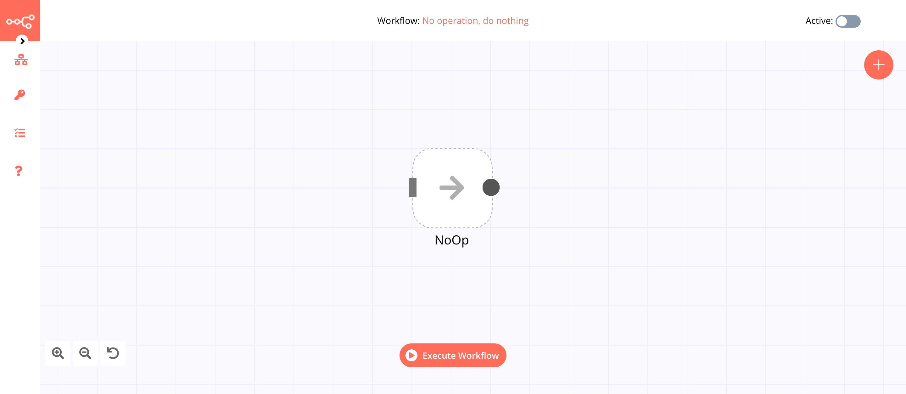
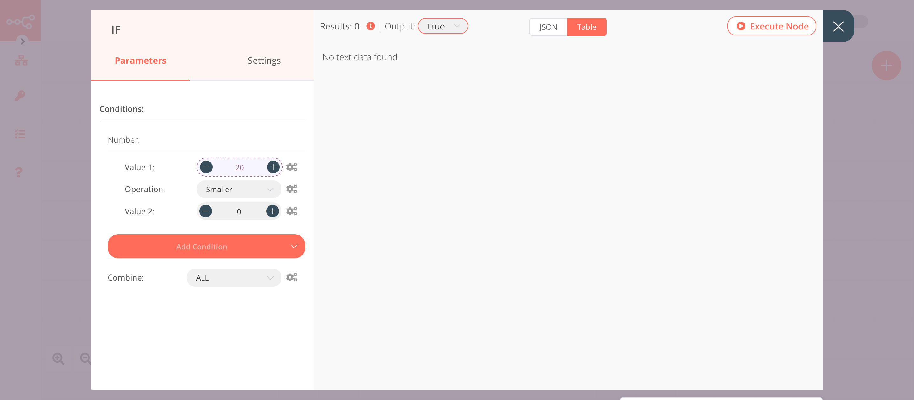
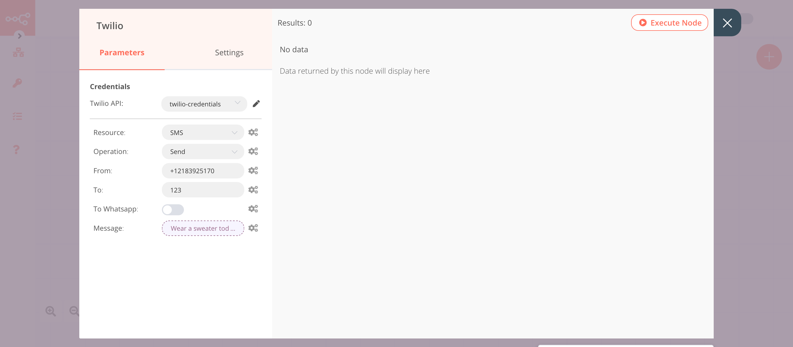
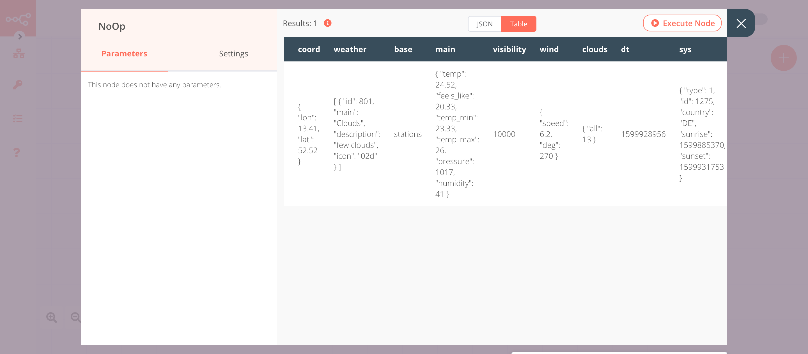

# No Operation, do nothing

The No Operation, do nothing node is used when you don't want to perform any operations.

## Example Usage

This workflow sends you daily SMS updates to tell you if you should wear a sweater. You can also find the [workflow](https://n8n.io/workflows/409) on n8n.io. This example usage workflow uses the following nodes.
- [Cron](../../core-nodes/Cron/README.md)
- [OpenWeatherMap](../../nodes/OpenWeatherMap/README.md)
- [IF](../../core-nodes/IF/README.md)
- [Twilio](../../nodes/Twilio/README.md)
- [NoOp]()

The final workflow should look like the following image.

### 1. Cron node

1. Click on the ***Add Cron Time*** button.
2. Click on ***Execute Node*** to run the node.

### 2. OpenWeatherMap node (Current Weather)

1. First of all, you'll have to enter credentials for the OpenWeatherMap node. You can find out how to do that [here](../../../credentials/OpenWeatherMap/README.md).
2. Enter the name of the city in the ***City*** field.
3. Click on ***Execute Node*** to run the node.

::: v-pre
### 3. IF node

1. Click on the ***Add Condition*** button and select 'Number' from the dropdown list.
2. Click on the gears icon next to the ***Value 1*** field and click on ***Add Expression***.
3. Select the following in the ***Variable Selector*** section: Nodes > OpenWeatherMap > Output Data > JSON > main > feels_like. You can also add the following expression: `{{$node["OpenWeatherMap"].json["main"]["feels_like"]}}`.
4. Enter `18` in the ***Value 2*** field.
5. Click on ***Execute Node*** to run the node.
:::

::: v-pre
### 4. Twilio node (send: sms)

1. First of all, you'll have to enter credentials for the Twilio node. You can find out how to do that [here](../../../credentials/Twilio/README.md).
2. Enter your Twilio number in the ***From*** field.
3. Enter your mobile number in the ***To*** field.
4. Click on the gears icon next to the ***Message*** field and click on ***Add Expression***.
5. Enter the message `Wear a sweater today, it is {{$node["OpenWeatherMap"].json["main"]["feels_like"]}}°C outside right now.` in the ***Expression Editor***.
6. Click on ***Execute Node*** to run the node.
:::

::: v-pre
### 5. No Operation, do nothing node

1. Click on ***Execute Node*** to run the node.
:::

