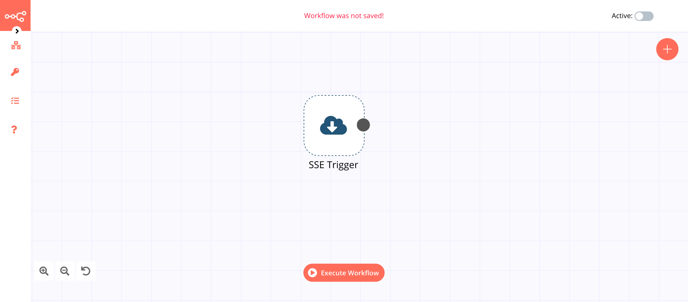

# SSE Trigger

Server-Sent Events (SSE) is a server push technology enabling a client to receive automatic updates from a server via HTTP connection. The SSE Trigger node is used to receive server-sent events and is a trigger node.

## Node Reference

***URL***: This field specifies the URL from which to receive the server-sent events.

## Example Usage

This workflow allows you to receive server-sent events using the SSE Trigger node. You can also find the [workflow](https://n8n.io/workflows/639) on n8n.io. This example usage workflow would use the following node.
- [SSE Trigger]()

The final workflow should look like the following image.

### 1. SSE Trigger node

1. Enter the URL in the ***URL*** field.
2. Click on ***Execute Node*** to run the node.
