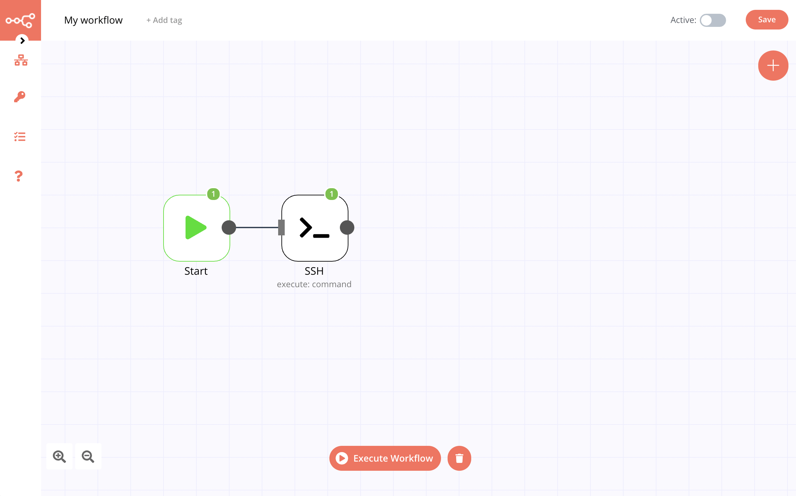

# SSH

The SSH node is useful for executing commands via the Secure Shell Protocol.

::: tip 🔑 Credential
Authentication for the SSH node requires that you have a username and password for connecting to the remote server, or an SSH key configured for the server or service you are connecting to. See [Connecting to GitHub with SSH] for an example](https://docs.github.com/en/github/authenticating-to-github/connecting-to-github-with-ssh).
:::

## Basic Operations

- Execute a command
- Download a file
- Upload a file

**Note:** To attach a file for upload, you will need to use an additional node such as the [Read Binary File](../../core-nodes/ReadBinaryFile/README.md) node or the [HTTP Request](../../core-nodes/HTTPRequest/README.md) node to pass the file as a data property.

## Node Reference

- ***Authentication:*** A dropdown list to choose between Password or Private Key authentication.
- ***Resource:*** A dropdown list used to specify if you are executing a command or processing a file.
- ***Operation:*** A dropdown list to select the action to be performed. When selecting **Command** as the ***Resource***, only **Execute** is available. For a **File** ***Resource*** you can select either **Upload** or **Download**.
- ***Command:*** Only visible for **Command** resources. The command to execute on the remote machine.
- ***Working Directory:*** Only visible for **Command** resources. The directory where the command should be executed.
- ***Path:*** Only visible for **Download** operation on file resources. The path where the desired file is found.
- ***Binary Property:*** Only visible for file resources. The name of the binary property which contains the data for the file to be uploaded.
- ***Target Directory:*** Only visible for **Upload** operations on file resources. The directory to upload the file to. The name of the file does not need to be specified, it's taken from the binary data file name. To override this behavior, set the parameter **File Name** under options.

## Example Usage

This workflow allows you to remotely connect to your computer via SSH. This example usage workflow would use the following nodes.
- [Start](../../core-nodes/Start/README.md)
- [SSH]()

The final workflow should look like the following image.

### 1. Start node

The start node exists by default when you create a new workflow.

### 2. SSH node

1. From the SSH Credentials dropdown, select ***Create New*** and complete the following fields:
    - ***Credentials Name***: Enter a descriptive name, here we used `ssh_demo`.
    - ***Host***: Enter the IP address of the server you are connecting to. Here we are using `192.168.1.8` for a local Mac set up for SSH access.
    - ***Port***: Enter the port to use for this connection. SSH used port 22 by default.
    - ***User***: Enter the your username for this server.
    - ***Password***: Enter your password for the provided username.
    - ***Private Key***: Only available for Private Key authentication. Enter your SSH key.
    - ***Passphrase***: Only available for Private Key authentication. Enter your passphrase.

2. Select ***Password*** from the ***Authentication*** dropdown list.
3. Select ***Command*** from the ***Resource*** dropdown list.
4. The ***Execute*** option is automatically selected as the ***Operation***.
5. In the ***Command*** field enter the command to execute. Here we used `ls` just to see the local directory contents.
6. In the ***Working Directory*** field you can enter where the command should be executed. Here we ran it in the root directory.
7. Click on ***Execute Node*** to run the node.

