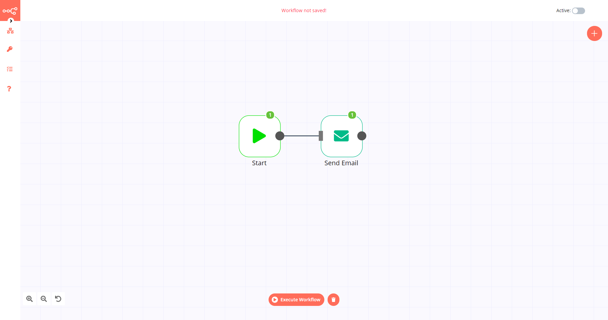

# Send Email

The Send Email node is used to send an email via an SMTP email server.

::: tip 🔑 Credential
You can find authentication information for this node [here](../../../credentials/SendEmail/README.md).
:::

::: tip 💡 Keep in mind
1. Before sending, ensure that you have already created email addresses that are approved for sending on your SMTP service.
2. The Send Email node merely sends an email via your SMTP server and plays no part in email deliverability.
3. To attach a file, you will need to use an additional node such as the [Read Binary File](../../core-nodes/ReadBinaryFile/README.md) node or the [HTTP Request](../../core-nodes/HTTPRequest/README.md) node to pass a file as a data property.
:::

## Basic Operations

- Send an email

## Node Reference

- **From Email:** The email address you are sending from.
- **To Email:** The recipient email address.
- **CC Email:** A field that can be used to specify an email address for a carbon copy of the email.
- **BCC Email:** A field that can be used to specify an email address for a blind carbon copy of the email.
- **Subject:** The subject of your message.
- **Text:** Your message, in plaintext.
- **HTML:** Your message, in HTML.
- **Attachments:** A field that can be used to attach any attachments as data properties.

## Example Usage

This workflow allows you to send an email using the Send Email node. You can also find the [workflow](https://n8n.io/workflows/584) on the website. This example usage workflow would use the following two nodes.
- [Start](../../core-nodes/Start/README.md)
- [Send Email]()

The final workflow should look like the following image.

### 1. Start node

The start node exists by default when you create a new workflow.

### 2. Send Email node

1. First of all, you'll have to enter credentials for the Send Email node. You can find out how to do that [here](../../../credentials/SendEmail/README.md).
2. Enter the email address you want to send from in the *From Email* field.
3. Enter the recipient email address in the *To Email* field.
4. Enter a subject for your message in the *Subject* field.
5. Enter your message in the *Text* field.
6. Click on *Execute Node* to run the workflow.
