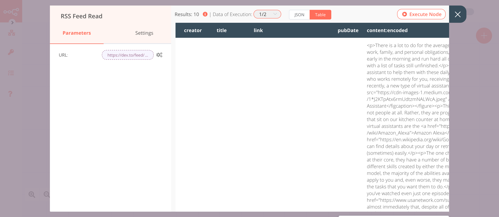

# Split In Batches

The Split In Batches node saves the original incoming data, and with each iteration, it returns a predefined amount of data. This node can be used to loop through the data.

## Node Reference

- **Batch Size:** The number of items to return with each call.
- ***Options:***
    - ***Reset:*** If set to true the node will reset.

## Example Usage

This workflow allows you to read RSS feed from two different sources using the Split In Batches node. You can also find the [workflow](https://n8n.io/workflows/687) on the website. This example usage workflow would use the following two nodes.
- [Start](../../core-nodes/Start/README.md)
- [Function](../../core-nodes/Function/README.md)
- [Split In Batches]()
- [RSS Feed Read](../../core-nodes/RSSRead/README.md)

The final workflow should look like the following image.


### 1. Start node

The start node exists by default when you create a new workflow.

::: v-pre
### 2. Function node

1. Paste the following JavaScript code snippet in the ***Function*** field.

```js
return [
  {
    json: {
      url: 'https://medium.com/feed/n8n-io',
    }
  },
  {
    json: {
      url: 'https://dev.to/feed/n8n',
    }
  }
];
```
2. Click on ***Execute Node*** to run the node.
:::


::: v-pre
### 3. SplitInBatches node

1. Set the batch size to `1` in the ***Batch Size*** field.
2. Click on ***Execute Node*** to run the node.
:::


::: v-pre
### 4. RSS Read node

1. Click on the gears icon next to the ***URL*** field and click on ***Add Expression***.
2. Select the following in the ***Variable Selector*** section: Nodes > SplitInBatches > Output Data > JSON > url. You can also add the following expression: `{{$node["SplitInBatches"].json["url"]}}`
3. Click on ***Execute Node*** to run the workflow.
:::



## FAQ

### Can the Split In Batches node receive data multiple times during the execution of the workflow?

The Split In Batches node uses the data that it receives the first time. It then splits this data into the batches and returns it until nothing is left.
