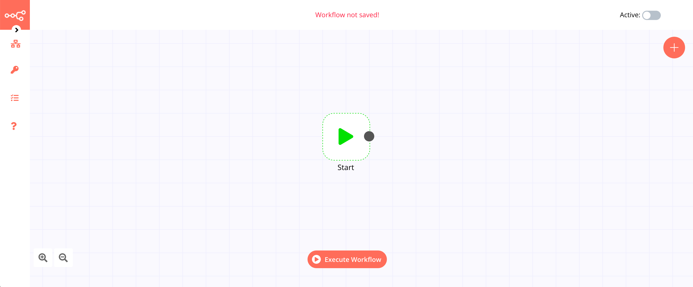

# Start

The start node is the first node in a workflow. It exists by default when you create a new workflow and looks like the following image.

In case there is no Trigger node in the workflow, the workflow always starts from the Start node. The Start node cannot be deleted. Even if a workflow contains a Trigger node, there would still be a Start node.
