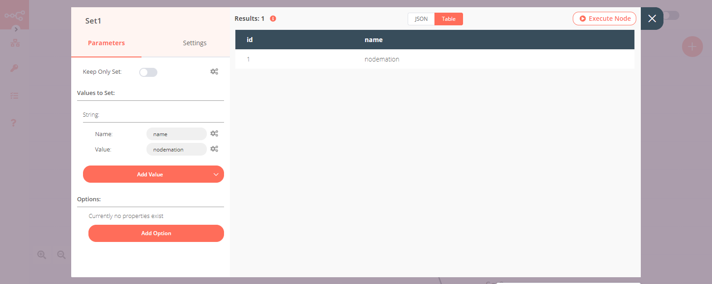

# Switch

The Switch node is used to route a workflow conditionally based on comparison operations. It is similar to the [IF](../../core-nodes/If/README.md) node, but supports up to four conditional routes.

## Node Reference

***Mode***: This dropdown is used to select whether the conditions will be defined as rules in the node, or as an expression, programmatically.

You can add comparison conditions using the ***Add Routing Rule*** dropdown. Conditions can be created based on the data type. The available comparison operations vary for each data type.

- Boolean
	- Equal
	- Not Equal
- Number
	- Smaller
	- Smaller Equal
	- Equal
	- Not Equal
	- Larger
	- Larger Equal
- String
	- Contains
	- Equal
	- Not Contains
	- Not Equal
	- Regex

You can route a workflow when none of the specified conditions are met using ***Fallback Output*** dropdown list.


## Example Usage

This workflow executes four different Set nodes based on the output given by a Switch node. You can also find the [workflow](https://n8n.io/workflows/688) on n8n.io. This example usage workflow would use the following nodes.
- [Start](../../core-nodes/Start/README.md)
- [Function](../../core-nodes/Function/README.md)
- [Switch]()
- [Set](../../core-nodes/Set/README.md)
- [NoOp](../../core-nodes/NoOperationDoNothing/README.md)


The final workflow should look like the following image.


### 1. Start node

The start node exists by default when you create a new workflow.


### 2. Function node

1. Enter the following code in the ***Function*** field.
```
return [
  {
    json: {
      id: 0,
    }
  },
  {
    json: {
      id: 1,
    }
  },
  {
    json: {
      id: 2,
    }
  }
];
```
2. Click on ***Execute Node*** to run the workflow.


### 3. Switch node

:::v-pre
1. Click on the gears icon next to the ***Value 1*** field and click on ***Add Expression***.
2. Select the following in the ***Variable Selector*** section: Nodes > Function > Output Data > JSON > id. You can also add the following expression: `{{$node["Function"].json["id"]}}`.
3. Click on the ***Add Routing Rule*** button.
4. From the ***Operation*** dropdown list, select 'Equal'.
5. Enter '0' in the ***Value 2*** and the ***Output*** fields.
6. Click on the ***Add Routing Rule*** button.
7. From the ***Operation*** dropdown list, select 'Equal'.
8. Enter '1' in the ***Value 2*** and the ***Output*** fields.
9. Click on the ***Add Routing Rule*** button.
10. From the ***Operation*** dropdown list, select 'Equal'.
11. Enter '2' in the ***Value 2*** and the ***Output*** fields.
12. Select '3' from the ***Fallback Output*** dropdown list.
13. Click on ***Execute Node*** to run the node.
:::


### 4. Set node (for '0' route)

1. Create a ***Set*** node connected to the '0' output of the Switch node.
2. Click on the ***Add Value*** button and select 'String' from the dropdown list.
3. Enter `name` in the ***Name*** field.
4. Enter `n8n` in the ***Value*** field.
5. Click on ***Execute Node*** to run the node.

**Note:** Notice that only the id with the value 0 made its way to this ***Set*** node.


### 5. Set1 node (for '1' route)

1. Create a ***Set*** node connected to the '1' output of the Switch node.
2. Click on the ***Add Value*** button and select 'String' from the dropdown list.
3. Enter `name` in the ***Name*** field.
4. Enter `nodemation` in the ***Value*** field.
5. Click on ***Execute Node*** to run the node.

**Note:** Notice that only the id with the value 1 made its way to this ***Set*** node.



### 6. Set2 node (for '2' route)

1. Create a ***Set*** node connected to the '2' output of the Switch node.
2. Click on the ***Add Value*** button and select 'String' from the dropdown list.
3. Enter `name` in the ***Name*** field.
4. Enter `nathan` in the ***Value*** field.
5. Click on ***Execute Node*** to run the node.

**Note:** Notice that only the id with the value 2 made its way to this ***Set*** node.


### 7. NoOp node (for '3' route)

1. Create a ***NoOp*** node connected to the '3' output of the Switch node.
2. Click on ***Execute Node*** to run the node.

**Note:** Notice that none of the ids made their way to this node since the values of the all the ids were either 0, 1, or 2.


## Further Reading

<FurtherReadingBlog node="Switch" />
