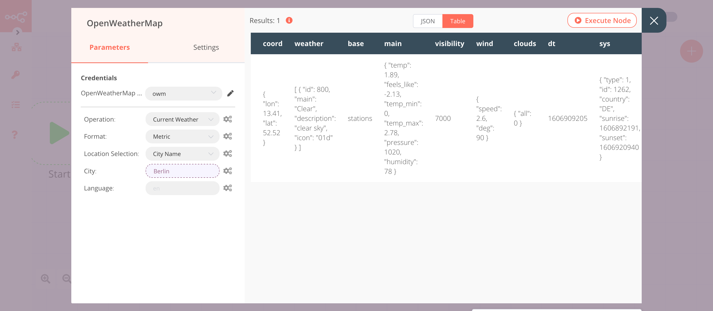
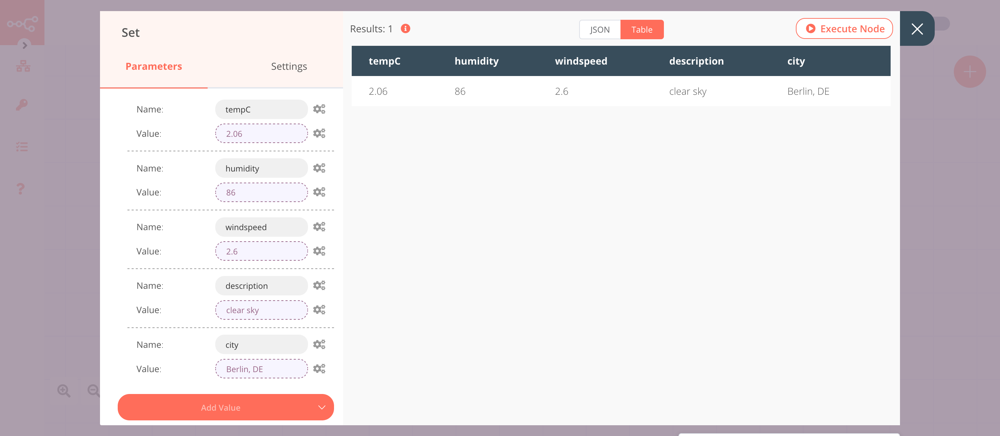

# Webhook

The Webhook node is one of the most powerful nodes in n8n. It allows you to create [webhooks](https://en.wikipedia.org/wiki/Webhook) which can be used to receive data from apps and services when an event occurs. It is a Trigger node, which means that it serves as the starting point for an n8n workflow. This allows several different services to connect to n8n and run a workflow when data is received.

::: tip 💡 Keep in mind
1. When using the Webhook node on the localhost, ensure that n8n is running with the [tunnel](../../../../getting-started/quickstart.md#start-with-tunnel) mode.
2. When working with a Production webhook, please ensure that you have saved and activated the workflow. Don’t forget that the data flowing through the webhook won’t be visible in the Editor UI with the Production webhook.
:::

Webhook nodes can be used as triggers for workflows when we want to receive data and run a workflow based on the data. The Webhook node also supports returning the data generated at the end of a workflow. This makes it very useful to build a workflow to process data and return the results, like an API endpoint.

While building or testing a workflow, we recommend that you use a test webhook URL. Using a test webhook ensures that you can view the incoming data in the Editor UI, which is useful for debugging. Make sure that you click on the *Execute Node* button to register the webhook before sending the data to the test webhook. The test webhook stays active for 120 seconds.

## Node Reference

First of all, in the parameters section, we have the Webhook URLs. Clicking on that will reveal the URLs for the webhook. Here you have two options, let’s understand the difference between them.

1. **Webhook URLs**
    - **Production**: A Production webhook is only registered when a workflow has been activated (via the switch on the top right of the page). You will never see its data in the Editor UI. To save the executions, you can either set that as a global default or you can specify that on a per-workflow basis in the workflow settings. You will then see the data from the workflow under ‘Past Executions’.

    - **Test**: A Test webhook is only registered in the time between executing a workflow via the UI and until the first call gets made (when it displays “waiting for Webhook call”). After the Test webhook gets called for the first time, it displays the data in the Editor UI, and then gets deactivated.

2. **Authentication:** The Webhook node supports two methods of authenticating a request that it receives.
	- [**Header Auth**](https://developer.mozilla.org/en-US/docs/Web/HTTP/Headers/Authorization) — A method of authentication where the specified header parameter must be passed along with the request. This method can be used when you want to authenticate using an API key or an access token, for example.
	- [**Basic Auth**](https://developer.mozilla.org/en-US/docs/Web/HTTP/Authentication) — A method of authentication where the specified username and password must be passed along with the request.

3. **HTTP Method:** The Webhook node supports receiving two types of [HTTP Requests](https://developer.mozilla.org/en-US/docs/Web/HTTP/Methods).
	- [**GET Request**](https://developer.mozilla.org/en-US/docs/Web/HTTP/Methods/GET) — GET requests are typically used to request data from a resource. This type of request is typically used to retrieve data from a service.
	- [**POST Request**](https://developer.mozilla.org/en-US/docs/Web/HTTP/Methods/POST) — POST requests are typically used to send data to a resource for a create/update operation. This type of request is typically used to send data to a service.

4. **Path:** YBy default, this field contains a randomly generated webhook URL path, to avoid conflicts with other webhook nodes. You can also manually specify a URL path if necessary. A good example would be if you were using n8n to prototype an API; and wanted consistent endpoint URLs.

5. **Response Code:** Allows you to customize the [HTTP response code](https://developer.mozilla.org/en-US/docs/Web/HTTP/Status) that the Webhook node will return upon successful execution.

6. **Response Mode:** This dropdown list allows you to select between two response modes.
    - **On Received:** When this option is selected, the Webhook node will return the specified response code along with the message “Workflow got started.”.
    - **Last Node:** When this option is selected, the Webhook node will return the specified response code along with the data output from the last node executed in the workflow.

**Optional Parameters:** The Webhook node also supports several optional methods that can be used during configuration.

- [**Response Headers**](https://developer.mozilla.org/en-US/docs/Glossary/Response_header) — This option allows you to specify additional headers in the Webhook response.
- **Raw Body** — This option is used to specify when the Webhook node will receive data in a RAW format, such as JSON or XML.
- **Binary Data** — This option is available only when the Webhook node is set to receive POST requests. Setting this to ‘true’ lets the Webhook node know that it will receive binary data (such as an image/audio). You can use this option when you expect to receive a file via your Webhook node.

**Conditional Parameters:** The Webhook node also supports several other parameters, that are used only in certain configurations.

- **Response Data:** This option is available only when the Response Mode is set to ‘Last Node’. It allows you to choose which data to return.
	- **All Entries** — Choose this option to return all the data generated by the last node in the workflow, as an array.
	- **First Entry JSON** — Choose this option to return the first data entry of the last node in the workflow, as a JSON object.
    - **First Entry Binary** — Choose this option to return the binary data of the first entry of the last node in the workflow, as a binary file.

## Example Usage

This workflow allows you to receive the weather information of a city using the Webhook and the OpenWeatherMap nodes. You can also find the [workflow](https://n8n.io/workflows/807) on n8n.io. This example usage workflow uses the following nodes.
- [Webhook]()
- [OpenWeatherMap](../../nodes/OpenWeatherMap/README.md)
- [Set](../../core-nodes/Set/README.md)

The final workflow should look like the following image.

### 1. Webhook node

This node will trigger the workflow. We will make a GET request to the Test URL and pass on a query parameter `city`. We will use the value of this query parameter in the next node in the workflow.

1. Click on ***Webhook URLs*** and select the 'Test' tab.
2. Copy the displayed URL. We will make a GET request to this URL later on.
3. Select 'Last Node' from the ***Response Mode***. This will return the data from the last executed node.
4. Select 'All Entries' from the ***Response Data***. This will return all the entries of the last executed node.
5. Save the workflow to register the webhook.
6. Click on ***Execute Node*** to run the node.
7. In a new browser tab, paste the URL you copied in the previous step and append it with `?city=Berlin`. Your URL should look similar to the following URL:`https://your-n8n.url/webhook/path?city=Berlin`. We are passing a query parameter `city` and assigning it the value `Berlin`.
8. Press Enter (or Return) to make a request to the Test Webhook URL.

In the screenshot below, you will notice that the node triggers the workflow and receives a query parameter. We will use the value of the query parameter in the next node in the workflow.

### 2. OpenWeatherMap node (Current Weather)

This node will return data about the current weather for the city that we received in the previous node.

1. First of all, you'll have to enter credentials for the OpenWeatherMap node. You can find out how to do that [here](../../../credentials/OpenWeatherMap/README.md).
2. Click on the gears icon next to the ***City*** field and click on ***Add Expression***.
::: v-pre
3. Select the following in the ***Variable Selector*** section: Nodes > Webhook > Output Data > JSON > query > city. You can also add the following expression: `{{$node["Webhook"].json["query"]["city"]}}`.
4. Click on ***Execute Node*** to run the node.
:::
In the screenshot below, you will notice that the node returns data about the current weather in Berlin.

### 3. Set node

We will use the Set node to ensure that only the data that we set in this node gets returned to the workflow. We will set the value of `temp` and `description` in this node.
::: v-pre
1. Click on ***Add Value*** and select 'String' from the dropdown list.
2. Enter `temp` in the ***Name*** field.
3. Click on the gears icon next to the ***Value*** field and click on ***Add Expression***.
4. Select the following in the ***Variable Selector*** section: Nodes > OpenWeatherMap > Output Data > JSON > main > temp. You can also add the following expression: `{{$node["OpenWeatherMap"].json["main"]["temp"]}}`.
5. Click on ***Add Value*** and select 'String' from the dropdown list.
6. Enter `description` in the ***Name*** field.
7. Click on the gears icon next to the ***Value*** field and click on ***Add Expression***.
8. Select the following in the ***Variable Selector*** section: Nodes > OpenWeatherMap > Output Data > JSON > weather > [Item: 0] > description. You can also add the following expression: `{{$node["OpenWeatherMap"].json["weather"][0]["description"]}}`.
9. Toggle ***Keep Only Set*** to `true`. We set this option to true to ensure that only the data that we have set in this node get passed on to the next nodes in the workflow.
10. Click on ***Execute Node*** to run the node.
:::
In the screenshot below, you will notice that the node sets the values of `temp` and `description`.

Save the workflow and execute it again by clicking on the ***Execute Workflow*** button in the Editor UI. This time you will receive the temperature and description as the response in the browser.

::: tip 💡 Activate workflow for production
This example workflow uses the Webhook node, which is a Trigger node. You'll need to save the workflow and then click on the Activate toggle on the top right of the screen to activate the workflow. Your workflow will then be triggered every time a GET request is sent to the ***Production*** webhook URL.
:::

## Further Reading

- [Webhook Node — The Versatile Toolbox 🧰](https://medium.com/n8n-io/webhook-node-the-versatile-toolbox-21cb17cee862)
- [Creating Custom Incident Response Workflows with n8n 🚨](https://medium.com/n8n-io/creating-custom-incident-response-workflows-with-n8n-9baef0bbedb9)
- [Cross-posting content automatically with n8n ✍️](https://medium.com/n8n-io/automating-cross-posting-blog-posts-using-n8n-%EF%B8%8F-af2a89601810)
- [Effortless video collaboration with Whereby, Mattermost, and n8n 📹](https://medium.com/n8n-io/effortless-video-collaboration-with-whereby-mattermost-and-n8n-8fc397feb9cb)
- [Webhooks Fun with n8n and Mattermost 🍸](https://medium.com/n8n-io/webhooks-fun-with-n8n-and-mattermost-4ebf7e2b4d2a)
