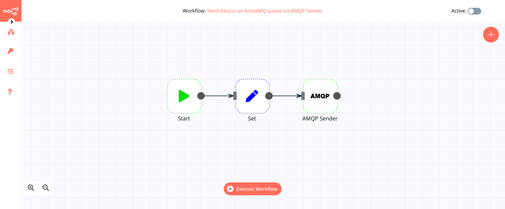

# AMQP Sender

[AMQP](https://www.amqp.org/) is an open standard application layer protocol for message-oriented middleware. The defining features of AMQP are message orientation, queuing, routing, reliability and security. This node supports AMQP 1.0 compatible message brokers.

::: tip 🔑 Credentials
You can find authentication information for this node [here](../../../credentials/AMQP/README.md).
:::

## Basic Operations

- Send message

## Example Usage

This workflow allows you to send a message to an [ActiveMQ](https://activemq.apache.org/) queue via AMQP Sender. You can also find the [workflow](https://n8n.io/workflows/512) on the website. This example usage workflow would use the following three nodes.
- [Start](../../core-nodes/Start/README.md)
- [Set](../../core-nodes/Set/README.md)
- [AMQP Sender]()

The final workflow should look like the following image.

### 1. Start node

The start node exists by default when you create a new workflow.

### 2. Set node

1. Click on the *Add Value* button and select 'String' from the dropdown list.
2. Enter `my_key`in the *Name* field.
3. Enter `my_value` in the *Value* field.

### 3. AMQP Sender node

1. First of all, you'll have to enter credentials for the AMQP Sender node. You can find out how to do that [here](../../../credentials/AMQP/README.md).
2. Enter the name of the queue or topic in the *Queue / Topic* field.
3. Click on *Execute Node* to run the workflow.

## Further Reading

- [Smart Factory Automation using IoT and Sensor Data with n8n 🏭](https://medium.com/n8n-io/smart-factory-automation-using-iot-and-sensor-data-with-n8n-27675de9943b)
