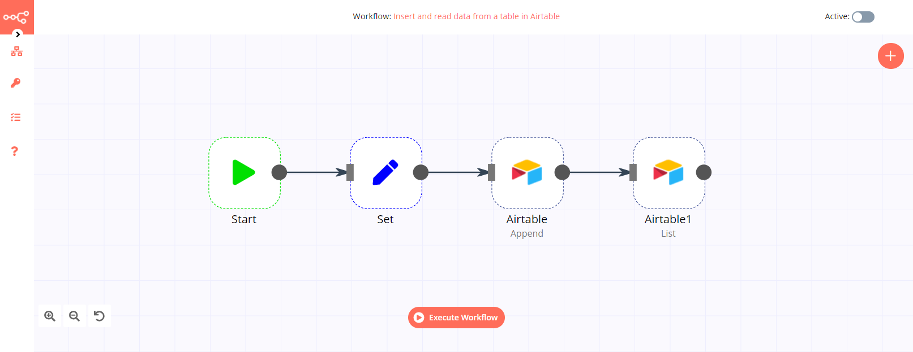
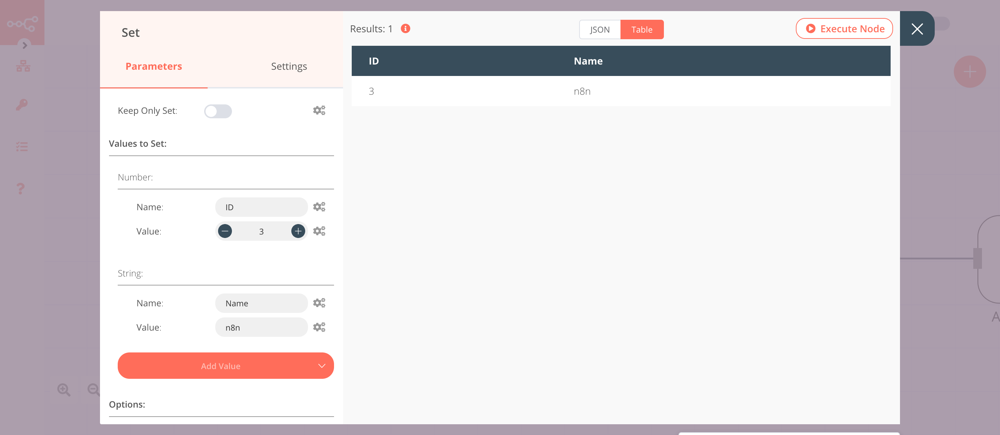

# Airtable

[Airtable](https://airtable.com/) is a spreadsheet-database hybrid, with the features of a database but applied to a spreadsheet. The fields in an Airtable table are similar to cells in a spreadsheet, but have types such as 'checkbox', 'phone number', and 'drop-down list', and can reference file attachments like images.

::: tip 🔑 Credentials
You can find authentication information for this node [here](../../../credentials/Airtable/README.md).
:::

## Basic Operations

- Append the data to a table
- Delete data from a table
- List data from a table
- Read data from a table
- Update data in a table

## Example Usage

This workflow allows you to insert and update data from a table in Airtable. You can also find the [workflow](https://n8n.io/workflows/818) on n8n.io. This example usage workflow would use the following nodes.
- [Start](../../core-nodes/Start/README.md)
- [Set](../../core-nodes/Set/README.md)
- [Airtable]()

The final workflow should look like the following image.

### 1. Start node

The start node exists by default when you create a new workflow.

### 2. Set node

We will use the Set node to set the values for the name and id fields for a new record.

1. Click on the ***Add Value*** button and select 'Number' from the dropdown list.
2. Enter `ID` in the ***Name*** field.
3. Enter an id in the ***Value*** field.
4. Click on the ***Add Value*** button and select 'String' from the dropdown list.
5. Enter `Name` in the ***Name*** field.
6. Enter a name in the ***Value*** field.
7. Click on ***Execute Node*** to run the node.

In the screenshot below, you will notice that the node sets the value for `ID` and `Name`.

### 3. Airtable node (Append)

This node will append the data that we set in the previous node to a table. Create a table like [this](https://airtable.com/shrN2yLZyKEETq1xj) in your Airtable base.

1. First of all, you'll have to enter credentials for the Airtable node. You can find out how to do that [here](../../../credentials/Airtable/README.md).
2. Select 'Append' from the ***Operation*** dropdown list.
3. Enter the Base ID in the ***Base ID*** field. For obtaining the Base ID, head over to their [API page](https://airtable.com/api) and select the correct base. You’ll find the Base ID there.
4. Enter the name of your table in the ***Table*** field.
5. Click on ***Execute Node*** to run the node.

In the screenshot below, you will notice that the node appends the data that we had set in the previous node.

### 4. Airtable1 node (List)

This node will list all the records with the name `n8n`. If you want to list records with a different name, use that name instead.
::: v-pre
1. Select the credentials that you entered in the previous node.
2. Select the 'List' option from the ***Operation*** dropdown list.
3. Click on the gears icon next to the ***Base ID*** field and click on ***Add Expression***.
4. Select the following in the ***Variable Selector*** section: Nodes > Airtable > Parameters > application. You can also add the following expression: `{{$node["Airtable"].parameter["application"]}}`.
5. Click on the gears icon next to the ***Table*** field and click on ***Add Expression***.
6. Select the following in the ***Variable Selector*** section: Nodes > Airtable > Parameters > table. You can also add the following expression: `{{$node["Airtable"].parameter["table"]}}`.
7. Click on ***Add Option*** and select 'Filter By Formula' from the dropdown list.
8. Enter `Name='n8n'` in the ***Filter By Formula*** field.
9. Click on ***Execute Node*** to run the node.
:::
In the screenshot below, you will notice that the node only returns the record with the name `n8n`.

### 5. Set1 node

We will use the Set node to ensure that only the data that we set in this node gets passed on to the next nodes in the workflow. We will set the value of `Name` in this node.

1. Click on the ***Add Value*** button and select 'String' from the dropdown list.
2. Enter `Name` in the ***Name*** field.
3. Enter `nodemation` in the ***Value*** field.
4. Toggle ***Keep Only Set*** to `true`. We set this option to true to ensure that only the data that we have set in this node get passed on to the next nodes in the workflow.
5. Click on ***Execute Node*** to run the node.

In the screenshot below, you will notice that the node sets the value of `Name`. This value is passed to the next node in the workflow.

### 6. Airtable2 node (Update)

This node will update the Name field of the record that we received from the previous Airtable node.
::: v-pre
1. Select the credentials that you entered in the previous Airtable node.
2. Select 'Update' from the ***Operation*** dropdown list.
3. Click on the gears icon next to the ***Base ID*** field and click on ***Add Expression***.
4. Select the following in the ***Variable Selector*** section: Nodes > Airtable > Parameters > application. You can also add the following expression: `{{$node["Airtable"].parameter["application"]}}`.
5. Click on the gears icon next to the ***Table*** field and click on ***Add Expression***.
6. Select the following in the ***Variable Selector*** section: Nodes > Airtable > Parameters > table. You can also add the following expression: `{{$node["Airtable"].parameter["table"]}}`.
7. Click on the gears icon next to the ***Id*** field and click on ***Add Expression***.
8. Select the following in the ***Variable Selector*** section: Nodes > Airtable1 > Output Data > JSON > id. You can also add the following expression: `{{$node["Airtable1"].json["id"]}}`.
9. Click on ***Execute Node*** to run the node.
:::
In the screenshot below, you will notice that the node updates the Name field.

## FAQs

### How to get the Record ID?

To fetch data for a particular record, you need the Record ID. There are two ways to get the Record ID.

**Create a Record ID column in Airtable**

To create a `Record ID` column in your table, refer to this [article](https://support.airtable.com/hc/en-us/articles/360051564873-Record-ID). You can then use this Record ID in your Airtable node.

**Use the List operation**

To get the Record ID of your record, you can use the ***List*** operation of the Airtable node. This operation will return the Record ID along with the fields. You can then use this Record ID in your Airtable node.

## Further Reading

- [Automating Conference Organization Processes with n8n](https://medium.com/n8n-io/automating-conference-organization-processes-with-n8n-ab8f64a7a520)
- [Building an expense tracking app in 10 minutes 📱](https://medium.com/n8n-io/building-an-expense-tracking-app-in-10-minutes-74b0cececc90)
