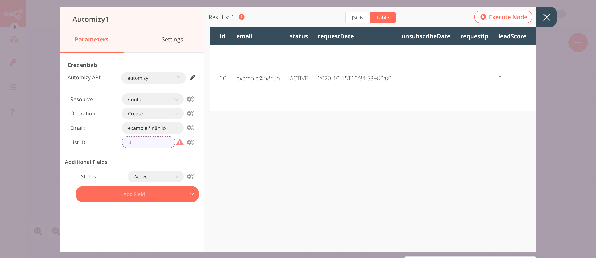

# Automizy

[Automizy](https://automizy.com/) is an email marketing automation software that offers AI-powered Subject Line Tester, AB testing, and email automation.

::: tip 🔑 Credentials
You can find authentication information for this node [here](../../../credentials/Automizy/README.md).
:::

## Basic Operations

::: details Contact
- Create a contact
- Delete a contact
- Get a contact
- Get all contacts
- Update a contact
:::

::: details List
- Create a list
- Delete a list
- Get a list
- Get all lists
- Update a list
:::

## Example Usage

This workflow allows you to create a new list, add a new contact to that list, update the contact, and get all contacts in the list using the Automizy node. You can also find the [workflow](https://n8n.io/workflows/720) on n8n.io. This example usage workflow uses the following nodes.
- [Start](../../core-nodes/Start/README.md)
- [Automizy]()

The final workflow should look like the following image.

### 1. Start node

The Start node exists by default when you create a new workflow.

### 2. Automizy node (create: list)

This node will create a new list called `n8n-docs` in Automizy.

1. First of all, you'll have to enter credentials for the Automizy node. You can find out how to do that [here](../../../credentials/Automizy/README.md). 
2. Select 'List' from the ***Resource*** dropdown list.
3. Enter `n8n-docs` in the ***Name*** field.
4. Click on ***Execute Node*** to run the node.

In the screenshot below, you will notice that the node creates a new list with the name `n8n-docs`.

### 3. Automizy1 node (create: contact)

This node creates a new contact and adds it to the list created in the previous node.
::: v-pre
1. Select the credentials that you entered in the previous node.
2. Enter the email address of the contact you want to add to the list in the ***Email*** field.
3. Click on the gears icon next to the ***List ID*** field and click on ***Add Expression***.
4. Select the following in the ***Variable Selector*** section: Nodes > Automizy > Output Data > JSON > id. You can also add the following expression: `{{$node["Automizy"].json["id"]}}`.
5. Click on ***Add Field*** and select 'Status' from the dropdown list.
6. Select 'Active' from the ***Status*** dropdown list.
7. Click on ***Execute Node*** to run the node.
:::
In the screenshot below, you will notice that the node creates a new contact with the email address `example@n8n.io` and status `Active` and adds it to the list `n8n-docs` created in the previous node.

### 4. Automizy2 node (update: contact)

This node updates the contact that we created in the previous node by adding the tag `reviewer` to it. Make sure that you create a tag in Automizy.

::: v-pre
1. Select the credentials that you entered in the previous node.
2. Select 'Update' from the ***Operation*** dropdown list.
3. Click on the gears icon next to the ***Email*** field and click on ***Add Expression***.
4. Select the following in the ***Variable Selector*** section: Nodes > Automizy1 > Output Data > JSON > email. You can also add the following expression: `{{$node["Automizy1"].json["email"]}}`.
5. Click on ***Add Field*** and select 'Tags' from the dropdown list.
6. Select a tag from the ***Tags*** dropdown list.
7. Click on ***Execute Node*** to run the node.
:::
In the screenshot below, you will notice that the node updates the contact created in the previous node by adding the tag `reviewer` to it.

### 5. Automizy3 node (getAll: contact)

This node returns all the contacts of the `n8n-docs` list that we created using the Automizy node.
::: v-pre
1. Select the credentials that you entered in the previous node.
2. Select 'Get All' from the ***Operation*** dropdown list.
3. Click on the gears icon next to the ***List ID*** field and click on ***Add Expression***.
4. Select the following in the ***Variable Selector*** section: Nodes > Automizy > Output Data > JSON > id. You can also add the following expression: `{{$node["Automizy"].json["id"]}}`.
5. Toggle ***Return All*** to true.
6. Click on ***Execute Node*** to run the node.
:::
In the screenshot below, you will notice that the node returns all the contacts that are present in the list `n8n-docs`.

