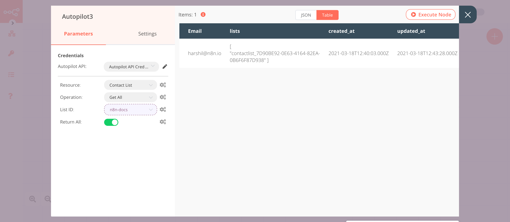

# Autopilot

[Autopilot](https://www.autopilothq.com/) is a visual marketing software that allows you to automate and personalize your marketing across the entire customer journey.

::: tip 🔑 Credentials
You can find authentication information for this node [here](../../../credentials/Autopilot/README.md).
:::

## Basic Operations

<Resource node="n8n-nodes-base.autopilot" />

## Example Usage

This workflow allows you to create a new list, add a new contact to that list, update the contact, and get all contacts in the list using the Autopilot node. You can also find the [workflow](https://n8n.io/workflows/990) on n8n.io. This example usage workflow uses the following nodes.
- [Start](../../core-nodes/Start/README.md)
- [Autopilot]()

The final workflow should look like the following image.

### 1. Start node

The Start node exists by default when you create a new workflow.

### 2. Autopilot node (create: list)

This node will create a new list called `n8n-docs` in Autopilot.

1. First of all, you'll have to enter credentials for the Autopilot node. You can find out how to do that [here](../../../credentials/Autopilot/README.md).
2. Select 'List' from the ***Resource*** dropdown list.
3. Enter `n8n-docs` in the ***Name*** field.
4. Click on ***Execute Node*** to run the node.

In the screenshot below, you will notice that the node creates a new list with the name `n8n-docs`.

### 3. Autopilot1 node (upsert: contact)

This node creates a new contact and adds it to the list created in the previous node.
::: v-pre
1. Select the credentials that you entered in the previous node.
2. Enter the email address of the contact you want to add to the list in the ***Email*** field.
3. Click on ***Add Field*** and select 'List ID' from the dropdown list.
4. Click on the gears icon next to the ***List ID*** field and click on ***Add Expression***.
5. Select the following in the ***Variable Selector*** section: Current Node > Input Data > JSON > list_id. You can also add the following expression: `{{$json["list_id"]}}`.
6. Click on ***Execute Node*** to run the node.
:::
In the screenshot below, you will notice that the node creates a new contact with the email address `harshil@n8n.io` and adds it to the list `n8n-docs` created in the previous node.

### 4. Autopilot2 node (update: contact)

This node updates the information of the contact that we created in the previous node.

::: v-pre
1. Select the credentials that you entered in the previous node.
2. Click on the gears icon next to the ***Email*** field and click on ***Add Expression***.
3. Select the following in the ***Variable Selector*** section: Nodes > Autopilot1 > Parameters > email. You can also add the following expression: `{{$node["Autopilot1"].parameter["email"]}}`.
4. Click on ***Add Field*** and select 'Company' from the dropdown list.
5. Enter `n8n` in the ***Company*** field.
6. Click on ***Execute Node*** to run the node.
:::
In the screenshot below, you will notice that the node updates the contact created in the previous node by adding the tag `reviewer` to it.

### 5. Autopilot3 node (getAll: contact)

This node returns all the contacts of the `n8n-docs` list that we created using the Autopilot node.
::: v-pre
1. Select the credentials that you entered in the previous node.
2. Select 'Contact List' from the ***Resource*** dropdown list.
3. Select 'Get All' from the ***Operation*** dropdown list.
4. Click on the gears icon next to the ***List ID*** field and click on ***Add Expression***.
5. Select the following in the ***Variable Selector*** section: Nodes > Autopilot > Output Data > JSON > list_id. You can also add the following expression: `{{$node["Autopilot"].json["list_id"]}}`.
6. Toggle ***Return All*** to true.
7. Click on ***Execute Node*** to run the node.
:::
In the screenshot below, you will notice that the node returns all the contacts that are present in the list `n8n-docs`.

