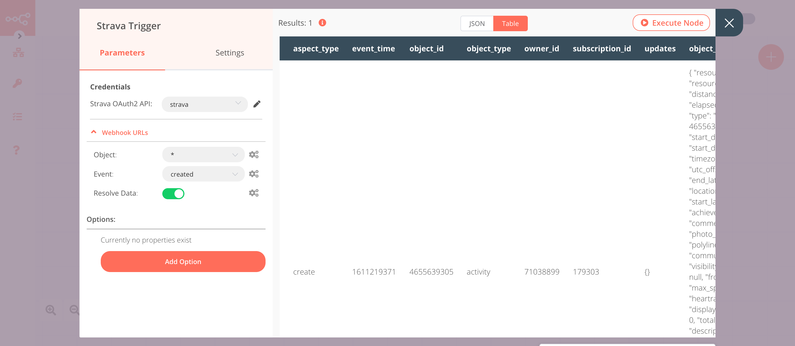

# Beeminder

[Beeminder](https://www.beeminder.com/) is a service that helps you to self-track and stick to your goals.

::: tip 🔑 Credentials
You can find authentication information for this node [here](../../../credentials/Beeminder/README.md).
:::

## Basic Operations

::: details Datapoint
- Create datapoint for a goal
- Delete a datapoint
- Get all datapoints for a goal
- Update a datapoint
:::

## Example Usage

This workflow allows you to add a datapoint to Beeminder when a new activity gets added to Strava. You can also find the [workflow](https://n8n.io/workflows/900) on n8n.io. This example usage workflow would use the following nodes.
- [Strava Trigger](../../trigger-nodes/StravaTrigger/README.md)
- [Beeminder]()

The final workflow should look like the following image.

### 1. Strava Trigger node

This node will trigger the workflow whenever a new activity gets added to your Strava account.

1. First of all, you'll have to enter credentials for the Strava Trigger node. You can find out how to do that [here](../../../credentials/Strava/README.md).
2. Select 'created' from the ***Event*** dropdown list.
3. Click on ***Execute Node*** to run the node.

In the screenshot below, you will notice that the node triggers the workflow when a new activity gets added to Strava.

### 2. Beeminder node (create: datapoint)

This node will create a datapoint for the goal `testing`. If you have created a goal with a different name, select that goal instead.

1. First of all, you'll have to enter credentials for the Beeminder node. You can find out how to do that [here](../../../credentials/Beeminder/README.md).
2. Select a goal from the ***Goal Name*** dropdown list.
3. Click on ***Add Field*** and select 'Comment'.
4. Click on the gears icon next to the ***Comment*** field and click on ***Add Expression***.
::: v-pre
5. Select the following in the ***Variable Selector*** section: Current Node > Input Data > JSON > object_data > name. You can also add the following expression: `{{$json["object_data"]["name"]}}`.
:::
6. Click on ***Execute Node*** to run the node.

In the screenshot below, you will notice that the node creates a datapoint in Beeminder.

::: tip 💡 Activate workflow for production
You'll need to save the workflow and then click on the Activate toggle on the top right of the screen to activate the workflow. Your workflow will then be triggered as specified by the settings in the Strava Trigger node.
:::
