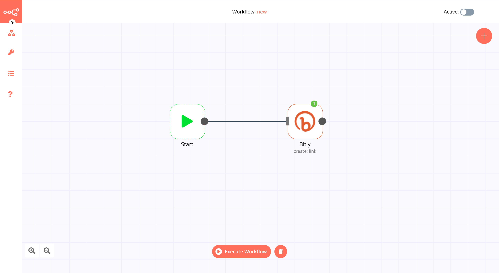

# Bitly

[Bitly](https://bitly.com/) is URL shortening service and a link management platform that allows users to shorten, create and share trusted, powerful links for businesses.

::: tip 🔑 Credentials
The instructions for authenticating with Bitly are [here](../../../credentials/Bitly).
:::

## Basic Operations

- Link
	- Create a link
	- Get a link
	- Update a link

## Example Usage

This workflow shows you how to create a new link. You can also find the [workflow](https://n8n.io/workflows/442) on this website. This example usage workflow uses the following two nodes.

- [Start](../../core-nodes/Start)
- [Bitly]()

The final workflow should look like the following image.

### 1. Start node

The start node exists by default when you create a new workflow.

### 2. Bitly node

1. First, ensure that you have entered authentication credentials through [this tutorial](../../../credentials/Bitly/README.md).
2. To create a link, select the *Link* option in the *Resource* field.
3. Select the *Create* option in the *Operation* field.
4. Enter the long URL in the *Long URL* field.
5. Click on *Execute Node* to run the workflow.

