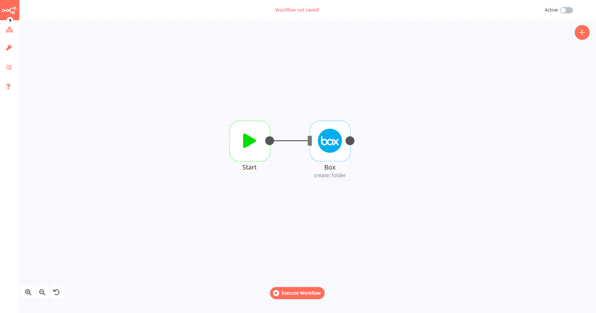

# Box

[Box](https://www.box.com/) is a cloud computing company which provides file sharing, collaborating, and other tools for working with files that are uploaded to its servers.

::: tip 🔑 Credentials
You can find authentication information for this node [here](../../../credentials/Box/README.md).
:::

## Basic Operations

<Resource node="Box" />

## Example Usage

This workflow allows you to create a folder on Box. You can also find the [workflow](https://n8n.io/workflows/559) on the website. This example usage workflow would use the following two nodes.
- [Start](../../core-nodes/Start/README.md)
- [Box]()

The final workflow should look like the following image.

### 1. Start node

The start node exists by default when you create a new workflow.

### 2. Box node

1. First of all, you'll have to enter credentials for the Box node. You can find out how to do that [here](../../../credentials/Box/README.md).
2. Select the 'Folder' option from the *Resource* dropdown list.
3. Enter the name of the folder in the *Name* field.
4. Click on *Execute Node* to run the workflow.
