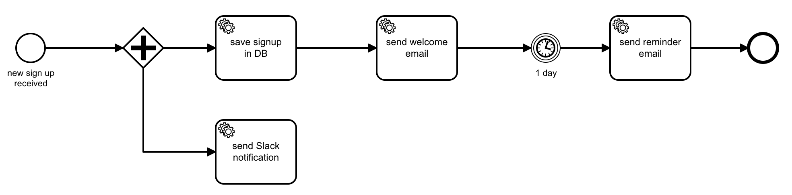
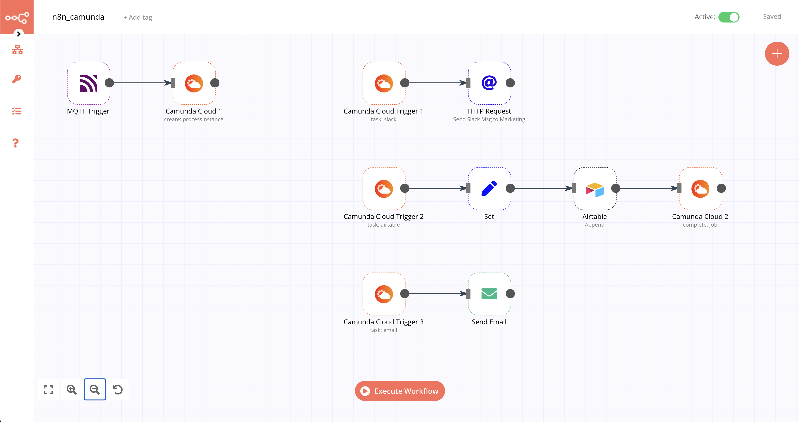

# Camunda Cloud

[Camunda Cloud](https://camunda.com/products/cloud/) is a Process Automation as a Service platform with a horizontally scalable [BPMN](https://en.wikipedia.org/wiki/Business_Process_Model_and_Notation) workflow engine and built-in tools for collaborative modeling, operations and analytics.

> ## 🔑 Credentials
>
> You can find authentication information for this node [here](../../../credentials/CamundaCloud/README.md).

## Supported Features

- Trigger n8n workflows from Camunda Cloud service tasks
- Create new Camunda Cloud process instances from n8n
- Publish messages to running Camunda Cloud process instances from n8n

## Example Use-Case

In this [example](./workflow.json) we combine the advantages of the powerful Camunda Cloud workflow engine with the extensibility of n8n to implement a long-running business process that handles new sign-ups.

The following BPMN process is already deployed to our Camunda Cloud account. How to do this is out of scope for this guide, but more information can be found [here](https://docs.camunda.io/docs/guides).

For illustration purposes the process is kept quite simple. An instance of the process is created when a new sign-up is received. In our case we will receive this event via MQTT and it will include some data attributes such as company, name and email.

The diamond-shaped symbol with the plus sign is a "parallel gateway", meaning that the flow will continue on all outgoing edges simultanously. We use it here to do two things in parallel: Saving the signup in our database and sending a slack notification to our marketing team.

Note the gear wheel pictogram in the tasks: They indicate that these tasks are so called "service tasks" that will be executed by an external system - in our case n8n! For n8n to receive a task, we simply need to configure the Camunda Cloud Trigger node's "Task Type" property with the same identifier as configured in the BPMN task (in our example "slack", "airtable" or "email").

In our n8n workflow we use a Camunda Cloud node to create a new process instance when we receive a new sign-up via MQTT. The data received as part of the MQTT event will be passed to Camunda Cloud as process variables.

And we use multiple Camunda Cloud Trigger nodes that subscribe to the respective service task in the BPMN diagram. Whenever our Camunda process reaches one of these service tasks, n8n will receive a trigger and execute the connected nodes (e.g. Send Email).

Camunda Cloud Trigger nodes can be configured to "Auto Complete" the respective BPMN task implicitly when they receive a new job, as shown in the "Send Email" part of the workflow. Alternatively you can use a separate Camunda Cloud node to explicitly mark a job as completed and even pass back additional variables to the Camunda process, as shown in the Airtable part of the workflow.

