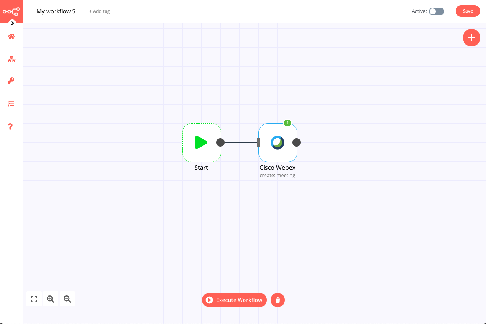

# Cisco Webex

[Cisco Webex](https://webex.com/) is a web conferencing and videoconferencing application.

::: tip 🔑 Credentials
You can find authentication information for this node [here](../../../credentials/ciscoWebex/README.md).
:::

## Basic operations

<Resource node="n8n-nodes-base.ciscoWebex"/>

## Example usage

This workflow allows you to create a new meeting. This example usage workflow uses the following node:
- [Cisco Webex]()

The final workflow should look like the following image.

### 1. Cisco Webex node

1. First enter your credentials for node. You can find out how to do that [here](../../../credentials/ciscoWebex/README.md).
2. Select 'Meeting' from the *Resource* dropdown list.
3. Select 'Create' from the *Operation* dropdown list.
4. Enter a *Title* for your new meeting.
5. Select the *Start* and *End* times for the meeting.
6. Optionally, use the *Additional Fields* menu to add further meeting details, for example an agenda, set the invitees, or a meeting recurrence.
7. Click on *Execute Node* to run the workflow.

