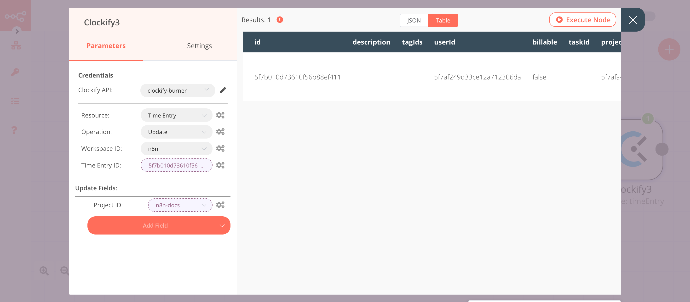

# Clockify

[Clockify](https://clockify.me/) is a free time tracker and timesheet app for tracking work hours across projects.

::: tip 🔑 Credentials
You can find authentication information for this node [here](../../../credentials/Clockify/README.md).
:::

## Basic Operations

<Resource node="Clockify" />

## Example Usage

This workflow allows you to create a project, tag, and time entry in Clockify. It also allows you to update the time entry in Clockify. You can also find the [workflow](https://n8n.io/workflows/701) on n8n.io. This example usage workflow would use the following nodes.
- [Start](../../core-nodes/Start/README.md)
- [Clockify]()

The final workflow should look like the following image.

### 1. Start node

The start node exists by default when you create a new workflow.

### 2. Clockify node (create: project)

This node will create a private project with a custom color. It will also add a note to the project in Clockify.

1. First of all, you'll have to enter credentials for the Clockify node. You can find out how to do that [here](../../../credentials/Clockify/README.md).
2. Select the ***Workspace ID*** from the dropdown list.
3. Enter the name of the project in the ***Project Name*** field.
4. Click on ***Add Field*** and select 'Color' from the dropdown list.
5. Select the color from the color-picker or enter the hexadecimal value of the color in the ***Color*** field.
6. Click on ***Add Field*** and select 'Is Public' from the dropdown list.
7. Toggle ***Is Public*** to false.
8. Click on ***Add Field*** and select 'Note' from the dropdown list.
9. Enter the note in the ***Note*** field.
10. Click on ***Execute Node*** to run the node.

In the screenshot below, you will notice that the node creates a new private project called `n8n-docs`. This project has a custom color `#0000FF` and a note `For n8n-docs`.

::: v-pre
### 3. Clockify1 node (create: tag)

This node will create a new tag in Clockify.

1. Select the credentials that you entered in the previous node.
2. Select 'Tag' from the ***Resource*** dropdown list.
3. Select the ***Workspace ID*** from the dropdown list.
4. Enter the name of the tag in the ***Name*** field.
5. Click on ***Execute Node*** to run the node.
:::

In the screenshot below, you will notice that the node creates a new tag called `docs` in the n8n workspace in Clockify.

::: v-pre
### 4. Clockify2 node (create: timeEntry)

This node creates a new time entry in Clockify with a description. It also adds the tag that we created in the previous step to the time entry.

1. Select the credentials that you entered in the previous node.
2. Select 'Time Entry' from the ***Resource*** dropdown list.
3. Select the ***Workspace ID*** from the dropdown list.
4. Select a start date and time for the ***Start*** field.
5. Click on ***Add Field*** and select 'Description' from the dropdown list.
6. Enter a description in the ***Description*** field.
7. Click on ***Add Field*** and select 'End' from the dropdown list.
8. Select a end date and time for the ***End*** field.
9. Click on ***Add Field*** and select 'Tag IDs' from the dropdown list.
10. Select the tag that you created in the previous step from the ***Tag IDs*** dropdown list.
11. Click on ***Execute Node*** to run the node.
:::

In the screenshot below, you will notice that the node creates a new time entry with a description and adds the tag that was created in the previous node.

::: v-pre
### 5. Clockify3 node (update: timeEntry)

This node will add the project to the time entry that was created by the Clockify node.

1. Select the credentials that you entered in the previous node.
2. Select 'Time Entry' from the ***Resource*** dropdown list.
3. Select 'Update' from the ***Operation*** dropdown list.
4. Select the ***Workspace ID*** from the dropdown list.
5. Click on the gears icon next to the ***Time Entry ID*** field and click on ***Add Expression***.
6. Select the following in the ***Variable Selector*** section: Nodes > Clockify2 > Output Data > JSON > id. You can also add the following expression: `{{$node["Clockify2"].json["id"]}}`.
7. Click on ***Add Field*** and select 'Project ID' from the dropdown list.
8. Click on the gears icon next to the ***Project ID*** field and click on ***Add Expression***.
9. Select the following in the ***Variable Selector*** section: Nodes > Clockify > Output Data > JSON > id. You can also add the following expression: `{{$node["Clockify"].json["id"]}}`.
10. Click on ***Execute Node*** to run the node.
:::

In the screenshot below, you will notice that the node has updated the time entry by adding the project ID we created in the Clockify node.

