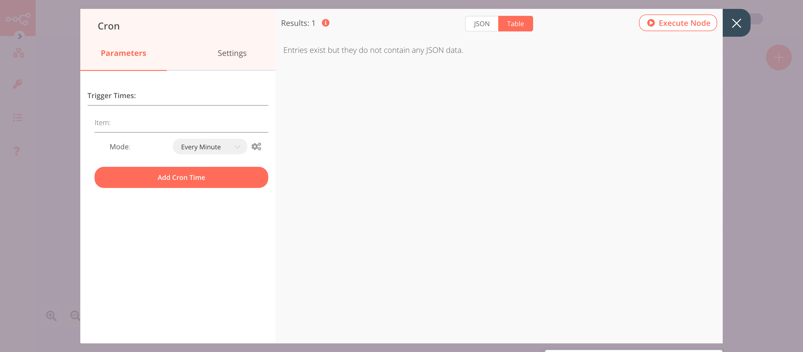

# CoinGecko

[CoinGecko](https://www.coingecko.com) provides a fundamental analysis of the crypto market. In addition to tracking price, volume and market capitalization, CoinGecko tracks community growth, open-source code development, major events, and on-chain metrics.

::: tip 🔑 Credentials
The CoinGecko node does not require authentication.
:::

## Basic Operations

<Resource node="n8n-nodes-base.coinGecko" />

## Example Usage

This workflow allows you to get the price of BTC in EUR using the CoinGecko node and send an SMS when the price is greater than or equal to €9000. You can also find the [workflow](https://n8n.io/workflows/704) on n8n.io. This example usage workflow would use the following nodes.
- [Cron](../../core-nodes/Cron/README.md)
- [CoinGecko]()
- [IF](../../core-nodes/If/README.md)
- [Twilio](../../nodes/Twilio/README.md)
- [No Operation, do nothing](../../core-nodes/NoOperationDoNothing/README.md)

The final workflow should look like the following image.

### 1. Cron node

The Cron node will trigger the workflow every minute.

1. Click on ***Add Cron Time***.
2. Select 'Every Minute' from the ***Mode*** dropdown list.
3. Click on ***Execute Node*** to run the node.

### 2. CoinGecko node (price: coin)

This node will get the price of BTC in EUR using the CoinGecko API. Feel free to select a different Coin ID and Currency.
1. Select 'Price' from the ***Operation*** dropdown list.
2. Select 'BTC' from the ***Coin IDs*** dropdown list.
3. Select 'EUR' from the ***Currencies*** dropdown list.
4. Click on ***Execute Node*** to run the node.

In the screenshot below, you will notice that the node fetches the price of 1 BTC in EUR. This information will be passed on to the next nodes in the workflow.

::: v-pre
### 3. IF node

This node will compare the price that we got from the CoinGecko node. If the price is greater than or equal to 9000, it will return true otherwise false.

1. Click on ***Add Condition*** and select 'Number' from the dropdown list.
2. Click on the gears icon next to the ***Value 1*** field and click on ***Add Expression***.
3. Select the following in the ***Variable Selector*** section: Nodes > CoinGecko > Output Data > JSON > bitcoin > eur. You can also add the following expression: `{{$node["CoinGecko"].json["bitcoin"]["eur"]}}`.
4. Select 'Larger Equal' from the ***Operation*** dropdown list.
5. Set ***Value 2*** to 9000.
6. Click on ***Execute Node*** to run the node.
:::

In the screenshot below, you will notice that the node returns an output for **true** when the price is greater than 9000.

### 4. Twilio node (send: sms)

This node sends an SMS to a number when the price is greater than or equal to 9000.

1. Connect this node with the **true** output of the IF node.
2. You'll have to enter credentials for the Twilio node. You can find out how to do that [here](../../../credentials/Twilio/README.md).
3. Enter the Twilio phone number in the ***From*** field.
4. Enter the receiver's phone number in the ***To*** field.
5. Click on the gears icon next to the ***Message*** field and click on ***Add Expression***.
::: v-pre
6. Enter `The price went up! The new price is €{{$node["CoinGecko"].json["bitcoin"]["eur"]}}` in the ***Expression*** field.
7. Click on ***Execute Node*** to run the node.
:::

In the screenshot below, you will notice that the node sends an SMS with the price that we obtained from the CoinGecko node.

::: v-pre
### 5. NoOp node

Adding this node here is optional, as the absence of this node won't make a difference to the functioning of the workflow.

1. Connect this node with the **false** output of the IF node.
2. Click on ***Execute Node*** to run the node.
:::

## Further Reading

<FurtherReadingBlog node="CoinGecko" />
