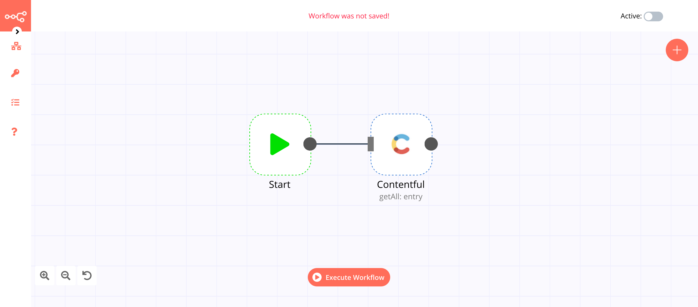

# Contentful

[Contentful](https://www.contentful.com/) provides a content infrastructure for digital teams to power content in websites, apps, and devices. It offers a central hub for structured content, powerful management and delivery APIs, and a customizable web app.

::: tip 🔑 Credentials
You can find authentication information for this node [here](../../../credentials/Contentful/README.md).
:::

## Basic Operations

::: details Asset
- Get an asset
- Get all assets
:::

::: details Content Type
- Get the content type
:::

::: details Entry
- Get an entry
- Get all entires
:::

::: details Locale
- Get all locale
:::

::: details Space
- Get space details
:::

## Example Usage

This workflow allows you to get all the entries using the Delivery API of Contentful. You can also find the [workflow](https://n8n.io/workflows/640) on n8n.io. This example usage workflow would use the following nodes.
- [Start](../../core-nodes/Start/README.md)
- [Contentful]()

The final workflow should look like the following image.

### 1. Start node

The start node exists by default when you create a new workflow.

### 2. Contentful node

1. First of all, you'll have to enter credentials for the Contentful node. You can find out how to do that [here](../../../credentials/Contentful/README.md).
2. Select 'Get All' from the ***Operation*** dropdown list.
3. Toggle ***Return All*** to true.
4. Click on ***Execute Node*** to run the node.

