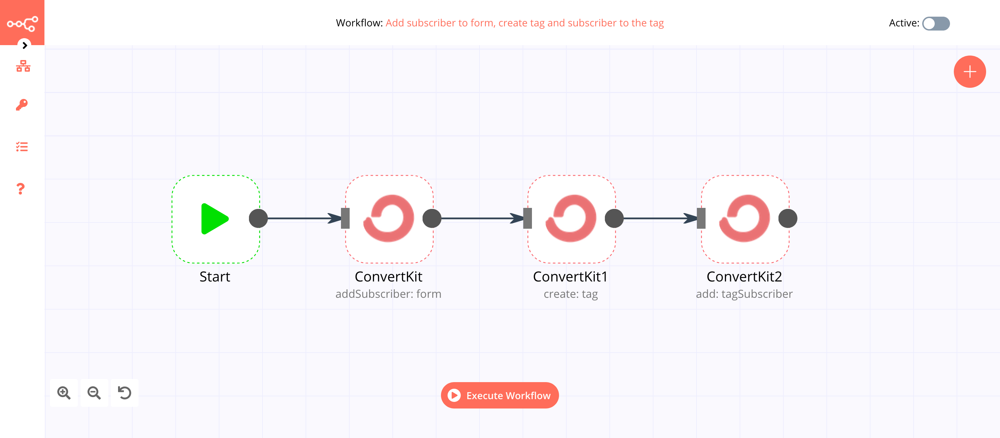
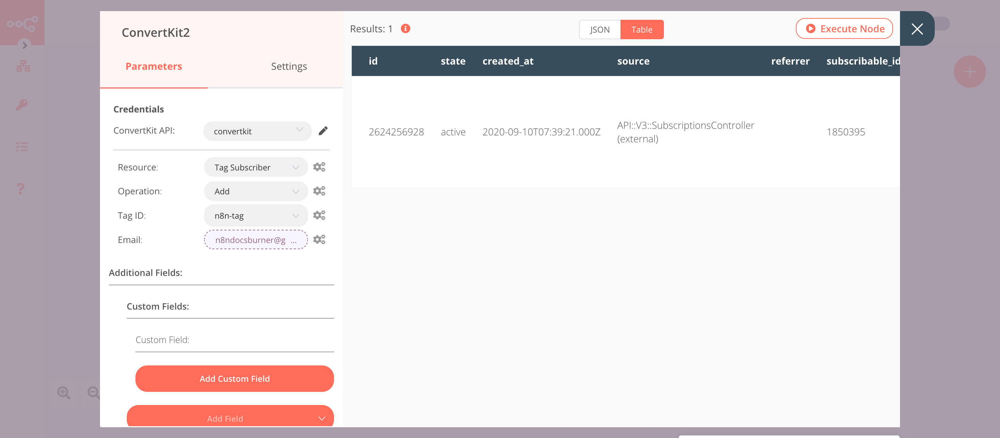

# ConvertKit

[ConvertKit](https://www.convertkit.com/) is a fully-featured email marketing platform. ConvertKit can be used to build an email list, send email broadcasts, automate sequences, create segments, and build landing pages.

::: tip 🔑 Credentials
You can find authentication information for this node [here](../../../credentials/ConvertKit/README.md).
:::	

## Basic Operations

::: details Custom Field
- Create a field
- Delete a field
- Get all fields
- Update a field
:::

::: details Form
- Add a subscriber
- Get all forms
- List subscriptions to a form including subscriber data
:::

::: details Sequence
- Add a subscriber
- Get all sequences
- Get all subscriptions to a sequence including subscriber data
:::

::: details Tag
- Create a tag
- Get all tags
:::

::: details Tag Subscriber
- Add a tag to a subscriber
- List subscriptions to a tag including subscriber data
- Delete a tag from a subscriber
:::

## Example Usage

This workflow allows you to add a subscriber to a form, create a tag and add the subscriber to the tag using the ConvertKit node. You can also find the [workflow](https://n8n.io/workflows/642) on n8n.io. This example usage workflow would use the following nodes.
- [Start](../../core-nodes/Start/README.md)
- [ConvertKit]()

The final workflow should look like the following image.

### 1. Start node

The start node exists by default when you create a new workflow.

### 2. ConvertKit node (addSubscriber: form)

1. First of all, you'll have to enter credentials for the ConvertKit node. You can find out how to do that [here](../../../credentials/ConvertKit/README.md).
2. Select the form from the ***Form ID*** dropdown list.
3. Enter the email address in the ***Email*** field.
4. Click on ***Execute Node*** to run the node.

::: v-pre
### 3. ConvertKit1 node (create: tag)

1. Select the credentials that you entered in the previous ConvertKit node.
2. Select 'Tag' from the ***Resource*** dropdown list.
3. Enter the tag name in the ***Name*** field.
4. Click on ***Execute Node*** to run the node.
:::

::: v-pre
### 4. ConvertKit2 node (add: tagSubscriber)

1. Select the credentials that you entered in the previous ConvertKit node.
2. Select 'Tag Subscriber' from the ***Resource*** dropdown list.
3. Select 'Add' from the ***Operation*** dropdown list.
4. Select the tag from the ***Tag ID*** dropdown list.
5. Click on the gears icon next to the ***Email*** field and click on ***Add Expression***.
6. Select the following in the ***Variable Selector*** section: Nodes > ConvertKit > Output Data > JSON > subscriber > email_address. You can also add the following expression: `{{$node["ConvertKit"].json["subscriber"]["email_address"]}}`.
7. Click on ***Execute Node*** to run the node.
:::

