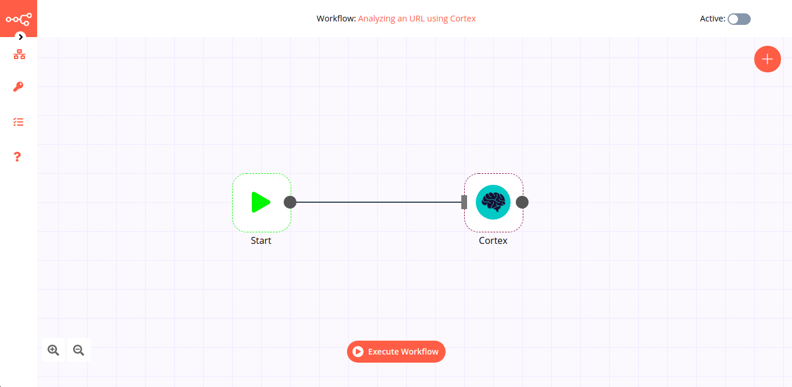

# Cortex

Cortex offers a powerful observable (URL, file, IP, etc) analysis mechanism. It helps SOCs, CSIRTs and security researchers to analyze collected observables using a single tool instead of several, respond to threats and interact with the constituency and other teams.

::: tip 🔑 Credentials
You can find authentication information for this node [here](../../../credentials/Cortex/README.md).
:::

## Basic Operations

- Analyzer
    - Execute
- Responder
    - Execute 
- Job
    - Get Job
    - Get Report
## Example Usage

This workflow allows you to analyze an URL and get the tool report. This example usage workflow uses the following two nodes.
- [Start](../../core-nodes/Start/README.md)
- [Cortex]()

The final workflow should look like the following image.

### 1. Start node

The start node exists by default when you create a new workflow.

### 2. Cortex node

1. First of all, you'll have to enter credentials for the Cortex node. You can find out how to do that [here](../../../credentials/Cortex/README.md).
2. Choose an Analyzer (that support URL, exp Abuse Finder) under the *Analyzer Type* field.
3. Select the 'URL' option under the *Observable Type* field.
4. Enter the URL to be analyzed under the *Observable Value* field.
5. Choose TLP level, cache and timeout (Optionals).
6. Click on *Execute Node* to run the workflow.
