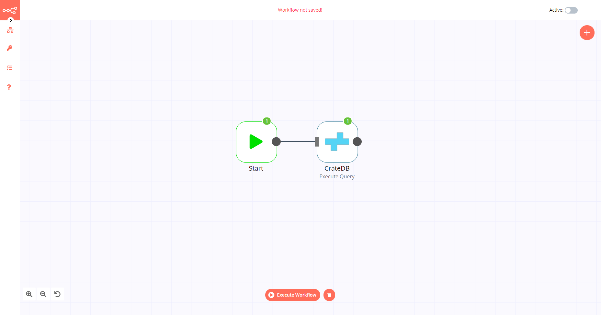
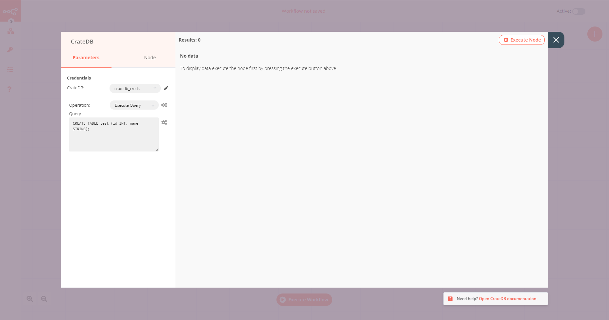
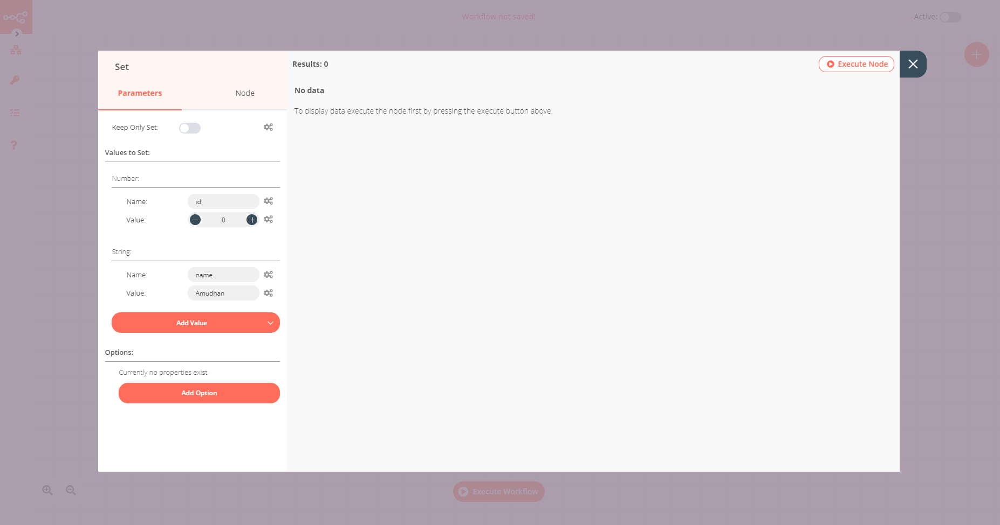
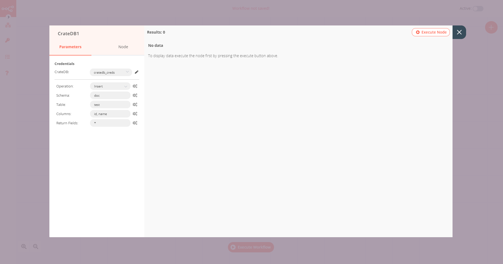

# CrateDB

[CrateDB](https://crate.io/) is an open-source distributed SQL database management system that integrates a fully searchable document-oriented data store based on a shared-nothing architecture, and is designed for high scalability.

::: tip 🔑 Credentials
You can find authentication information for this node [here](../../../credentials/CrateDB/README.md).
:::

## Basic Operations

- Execute an SQL query
- Insert rows in database
- Update rows in database

## Example Usage

This workflow allows you to create a table and insert data into it in CrateDB. You can also find the [workflow](https://n8n.io/workflows/597) on n8n.io. This example usage workflow would use the following nodes.
- [Start](../../core-nodes/Start/README.md)
- [Set](../../core-nodes/Set/README.md)
- [CrateDB]()

The final workflow should look like the following image.

### 1. Start node

The start node exists by default when you create a new workflow.

### 2. CrateDB node (Execute Query)

1. First of all, you'll have to enter credentials for the CrateDB node. You can find out how to do that [here](../../../credentials/CrateDB/README.md).
2. Select 'Execute Query' from the ***Operation*** dropdown list.
3. Enter the following SQL query in the ***Query*** field: `CREATE TABLE test (id INT, name STRING);`.
4. Click on the ***Node*** tab and toggle ***Always Output Data*** to true.
5. Click on ***Execute Node*** to run the node.

### 3. Set node

1. Click on the ***Add Value*** button and select 'Number' from the dropdown list.
2. Enter `id` in the ***Name*** field.
3. Click on the ***Add Value*** button and select 'String' from the dropdown list.
4. Enter `name` in the ***Name*** field.
5. Enter the value for the name in the ***Value*** field.
6. Click on ***Execute Node*** to run the node.

### 4. CrateDB1 node (Insert)

1. Select the credentials that you entered in the previous CrateDB node.
2. Enter `test` in the ***Table*** field.
3. Enter `id, name` in the ***Columns*** field.
4. Click on ***Execute Node*** to run the node.

## FAQs

### How to specify the data type of a column?
To specify the data type of a column, append the column name with `:type`, where `type` is the data type of that column. For example, if you want to specify the type `int` for the column *id* and type `text` for the column *name*, you can use the following snippet in the ***Columns*** field: `id:init,name:text`.

## Further Reading

- [Smart Factory Automation using IoT and Sensor Data with n8n 🏭](https://medium.com/n8n-io/smart-factory-automation-using-iot-and-sensor-data-with-n8n-27675de9943b)
