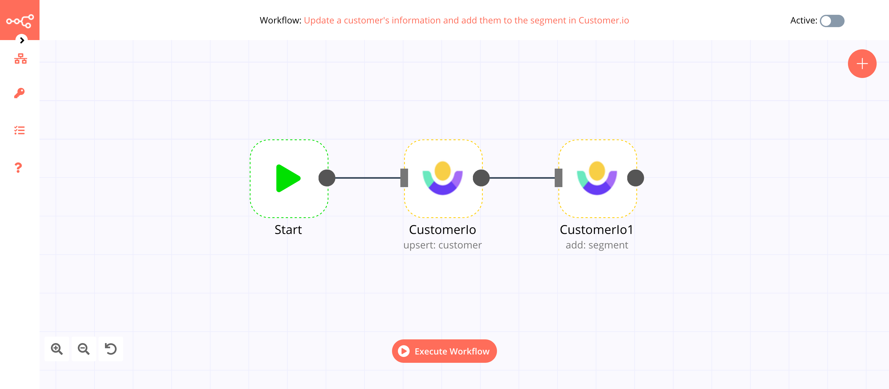
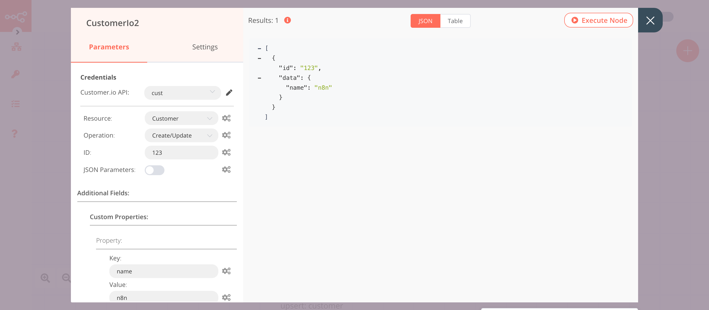
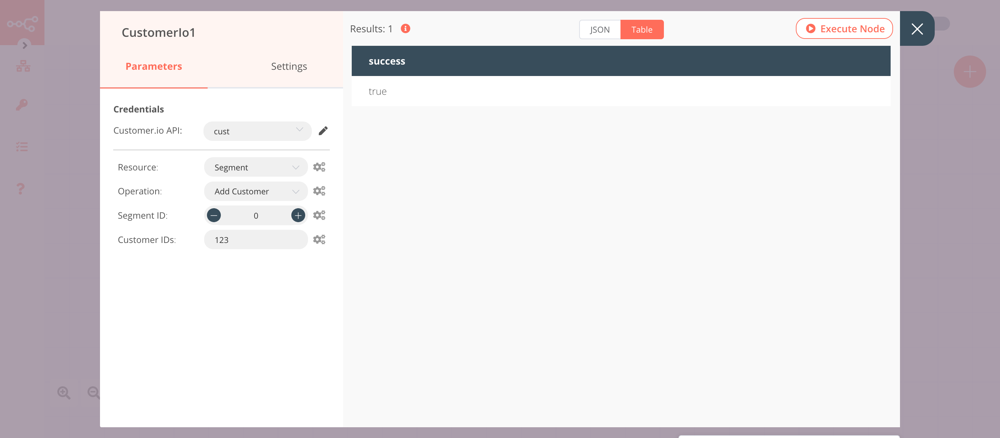

# Customer.io

[Customer.io](https://customer.io/) enables users to send newsletters to selected segments of customers using their website data. You can send targeted emails, push notifications, and SMS to lower churn, create stronger relationships, and drive subscriptions.

::: tip 🔑 Credentials
You can find authentication information for this node [here](../../../credentials/CustomerIo/README.md).
:::	

## Basic Operations

- Customer
    - Create/Update a customer
    - Delete a customer
- Event
    - Track a customer event
    - Track an anonymous event
- Campaign
    - Get a campaign
    - Get all campaigns
    - Get metrics
- Segment
    - Add a customer
    - Remove a customer

## Example Usage

This workflow allows you to create a customer and add them to a segment in Customer.io. You can also find the [workflow](https://n8n.io/workflows/646) on n8n.io. This example usage workflow would use the following nodes.
- [Start](../../core-nodes/Start/README.md)
- [Customer.io]()

The final workflow should look like the following image.

### 1. Start node

The start node exists by default when you create a new workflow.

### 2. CustomerIo node (upsert: customer)

1. First of all, you'll have to enter credentials for the Customer.io node. You can find out how to do that [here](../../../credentials/CustomerIo/README.md).
2. Enter a customer id in the ***ID*** field.
3. Click on the ***Add Field*** button and select 'Custom Properties' from the dropdown list.
4. Click on the ***Choose Option To Add*** button.
5. Enter `name` in the ***Key*** field.
6. Enter the name of the customer in the ***Value*** field.
7. Click on ***Execute Node*** to run the node.

::: v-pre
### 3. CustomerIo1 node (add: segment)

1. Select the credentials that you entered in the previous Customer.io node.
2. Select 'Segment' from the ***Resource*** field.
3. Click on the gears icon next to the ***Customer IDs*** field and click on ***Add Expression***.
4. Select the following in the ***Variable Selector*** section: Nodes > CustomerIo > Output Data > JSON > id. You can also add the following expression: `{{$node["CustomerIo"].json["id"]}}`.
4. Click on ***Execute Node*** to run the node.
:::

