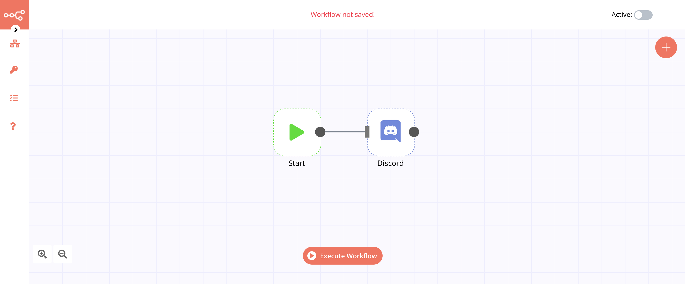
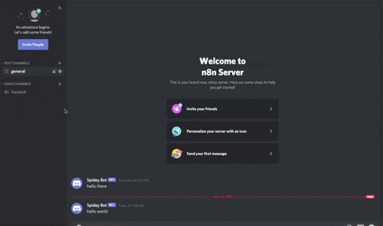

# Discord

[Discord](https://discord.com/) is a voice, video, and text communications platform for groups. Discord allows users to programatically send messages using webhooks.

The Discord Node does not require Authentication, but you must have access to a channel's settings to use webhooks.

## Basic Operations

- Send messages in a Discord Channel

## Example Usage

This workflow allows you to send a message to a Discord channel using webhooks. You can also find the [workflow](https://n8n.io/workflows/410) on this website. This example usage workflow would use the following two nodes.
- [Start](../../core-nodes/Start)
- [Discord]()

The final workflow should look like the following image.

### 1. Start node

The start node exists by default when you create a new workflow.

### 2. Discord Node

1. In order to create a Discord webhook that sends content to your channel, go to the settings of your channel.
2. Click Webhooks.
3. Name your bot and copy the link of the webhook.
4. Back on n8n, paste your webhook into the *Webhook URL* field of the Discord Node.
5. Enter your message in the *Text* field.
6. Click on *Execute Node* to run the workflow. :tada:

