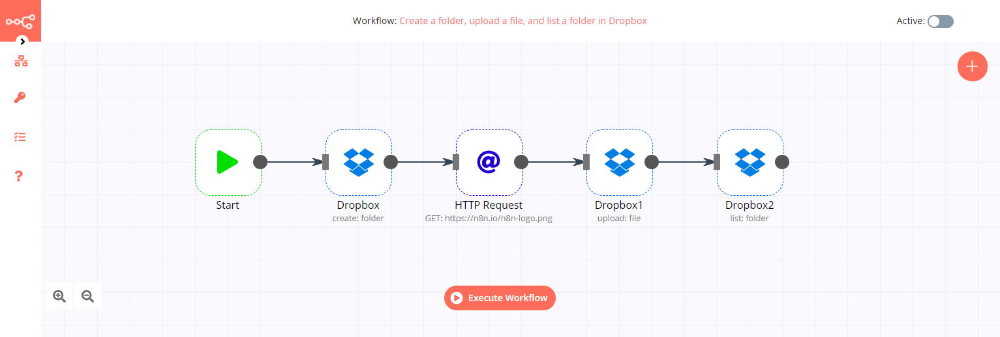
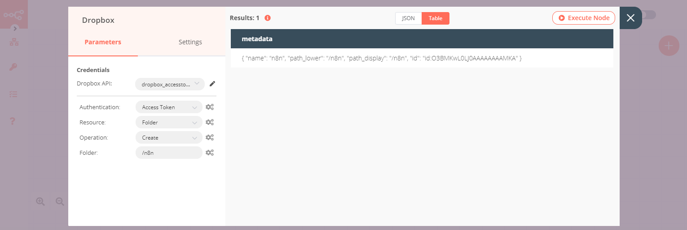
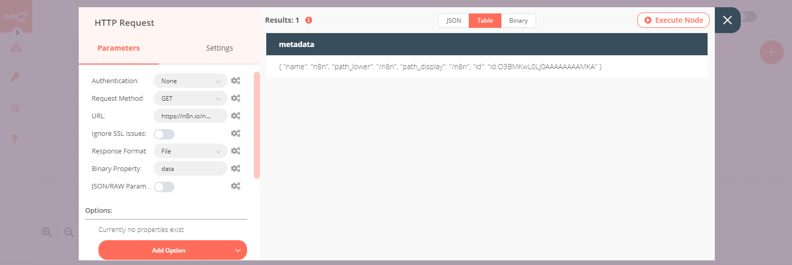
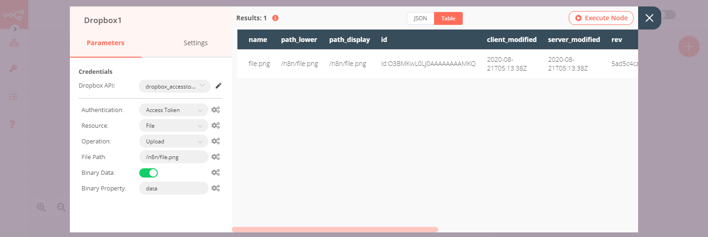
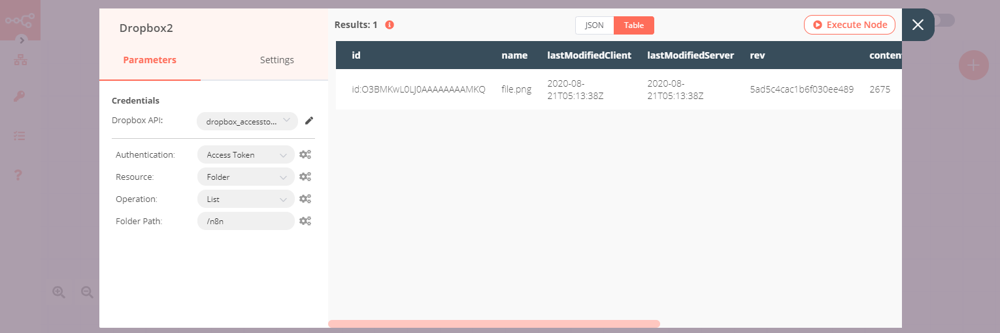

# Dropbox

[Dropbox](https://dropbox.com) is a cloud-based file storage and sharing service, accessible through multiple devices.

::: tip 🔑 Credentials
You can find authentication information for this node [here](../../../credentials/Dropbox/README.md).
:::

## Basic Operations

<Resource node="n8n-nodes-base.dropbox" />

## Example Usage

This workflow allows you to create a folder in Dropbox, upload a file into that folder, and list the contents of the folder. You can also find the [workflow](https://n8n.io/workflows/615) on n8n.io. This example usage workflow uses the following nodes.
- [Start](../../core-nodes/Start/README.md)
- [Dropbox]()
- [HTTP Request](../../core-nodes/HTTPRequest/README.md)

The final workflow should look like the following image.

### 1. Start node

The Start node exists by default when you create a new workflow.

### 2. Dropbox node (create: folder)

1. First of all, you'll have to enter credentials for the Dropbox node. You can find out how to do that [here](../../../credentials/Dropbox/).
2. Select 'Folder' from the ***Resource*** dropdown list.
3. Enter the name of the new folder in the ***Folder*** field.
4. Click on ***Execute Node*** to run the workflow.

### 3. HTTP Request node (GET)

1. Enter `https://n8n.io/n8n-logo.png` in the ***URL*** field.
2. Select 'File' from the ***Response Format*** dropdown list.
3. Click on ***Execute Node*** to run the workflow.

### 4. Dropbox1 node (upload: file)

1. Select the credentials that you entered in the Dropbox node.
2. Enter the path of the Dropbox folder you created in the previous steps along with a file name in the ***File Path*** field.
3. Set the ***Binary Data*** toggle to true.
4. Click on ***Execute Node*** to run the node.

### 5. Dropbox2 node (list: folder)

1. Select the credentials that you entered in the Dropbox node.
2. Select 'Folder' from the ***Resource*** dropdown list.
3. Select 'List' from the ***Operation*** dropdown list.
4. Enter the path of the Dropbox folder you created in the previous steps in the ***Folder Path*** field.
5. Click on ***Execute Node*** to run the node.

