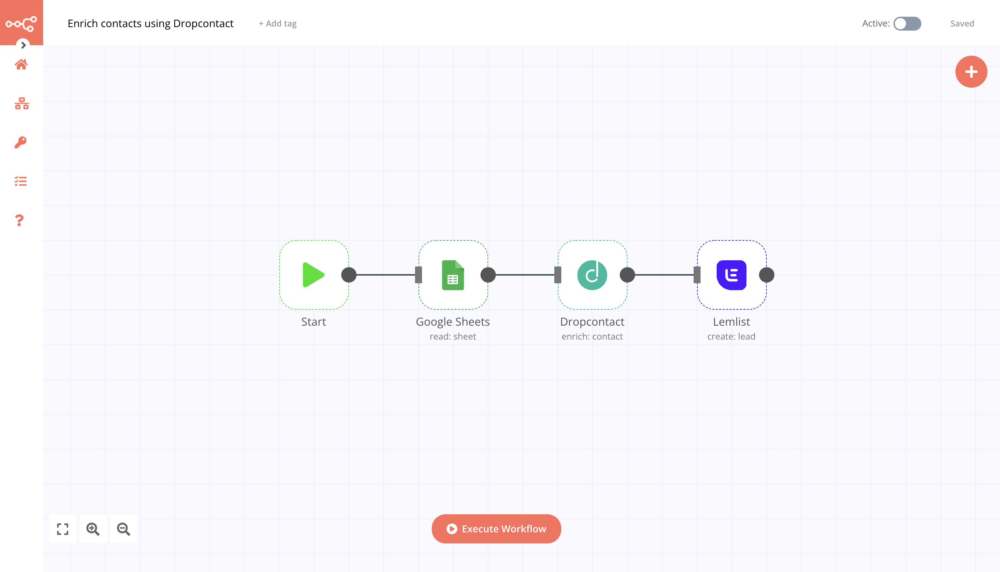
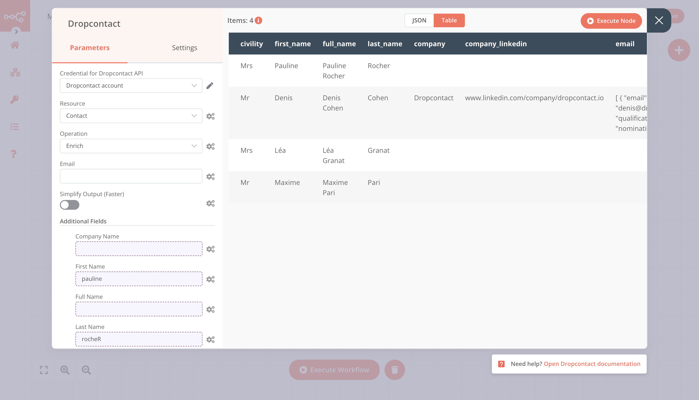
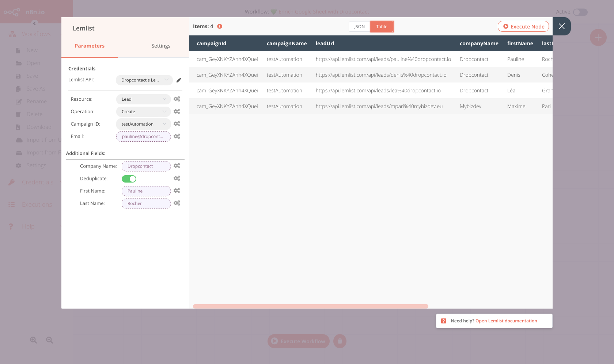

# Dropcontact

[Dropcontact](https://www.dropcpontact.com) is an email finder platform that allows you to automatically find, verify and validate nominative emails and enrich your contacts with all efficient information to contact him.

::: tip 🔑 Credentials
You can find authentication information for this node [here](../../../credentials/Dropcontact/README.md).
:::

## Basic Operations

<Resource node="n8n-nodes-base.dropcontact" />

## Example Usage

This workflow allows you to find email and enrich your contact from a Google Sheet and add them to Lemlist. You can also find the [workflow](https://n8n.io/workflows/1304) on n8n.io. 

This example usage workflow would use the following nodes.
- [Start](../../core-nodes/Start/README.md)
- [Google Sheets node](../../nodes/GoogleSheets/README.md)
- [Dropcontact node]()
- [Lemlist node](../../nodes/Lemlist/README.md)

### 1. Start Node
The start node exists by default when you create a new workflow.

### 2. Google Sheet node

This node will list all the records from Google Sheet. Create a sheet like [this](https://docs.google.com/spreadsheets/d/1jCyGrz01b7wdoujEHHZvw-JD5zszTMFqn8cvvSnLPrE/edit#gid=0) in your Google Drive.

1. First of all, you'll have to enter credentials for the Google Sheet node. You can find out how to do that [here](../../../credentials/Google/README.md).
::: v-pre
2. Select the 'Sheet' option from the ***Ressource*** dropdown list.
3. Select the 'Read' option from the ***Operation*** dropdown list.
4. Enter the Sheet ID in the ***Sheet ID*** field. Your Google Sheet ID is available in the URL `https://docs.google.com/spreadsheets/d/{spreadsheetId}/edit`
5. In the Range field, enter the same range used in the previous Google Sheets node.
6. Click on the Add Option button and select 'Value Render Mode' from the dropdown list.
Select 'Formatted Value' from the Value Render Mode dropdown list. Refer to the [FAQs](https://docs.n8n.io/nodes/n8n-nodes-base.googleSheets/#faqs) for more information on why we used this option.
7. Click on ***Execute Node*** to run the node.
:::
In the screenshot below, you will notice that the node returns the information of the leads.

### 3. Dropontact node

This node will find the verified email address and enrich the contact.

1. First of all, you'll have to enter credentials for the Dropcontact node. You can find out how to do that [here](../../../credentials/Dropcontact/README.md).
::: v-pre
2. Select 'Contact' from the ***Resource*** dropdown list.
3. Select 'Enrich' from the ***Operation*** dropdown list.
4. For each input field, click on the gears icon next to the field and click on 'Add Expression'.
The email field is not required. If you don't have it, you can find the email from the first name, last name, and the company website of your lead. If you have it, it will be verfied.
5. Select the following in the ***Variable Selector*** section: Node > Input Data > JSON > fields > email . You can also add the following expression: `{{$json["fields"]["email"]}}`.
6. Click on ***Execute Node*** to run the node.
:::
In the screenshot below, you will notice that the Dropcontact node has enriched your data.

### 4. Lemlist node

This node will create new leads for a campaign in Lemlist.

1. First of all, you'll have to enter credentials for the Lemlist node. You can find out how to do that [here](../../../credentials/Lemlist/README.md).
2. Select 'Lead' from the ***Resource*** dropdown list.
3. Select a campaign from the ***Campaign ID*** dropdown list.
4. Click on the gears icon next to the ***Email*** field and click on 'Add Expression'.
5. Select the following in the ***Variable Selector*** section: Dropcontact > Input Data > JSON > fields > email.
6. Click on the ***Add Field*** button and select 'First Name'. Similarly add 'Last Name' and 'Company'.
7. Click on the gears icon next to the field and click on Add Expression. Select the right Variable. 

In the screenshot below, you will notice that the node creates new enriched leads in Lemlist.

