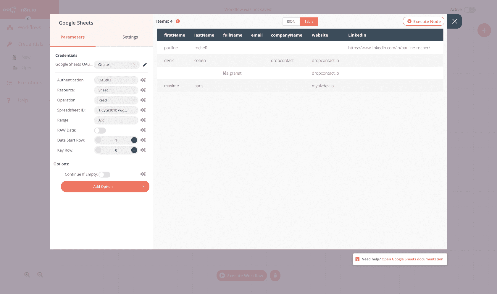
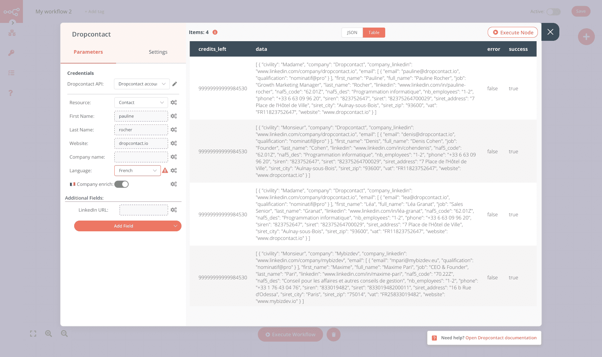
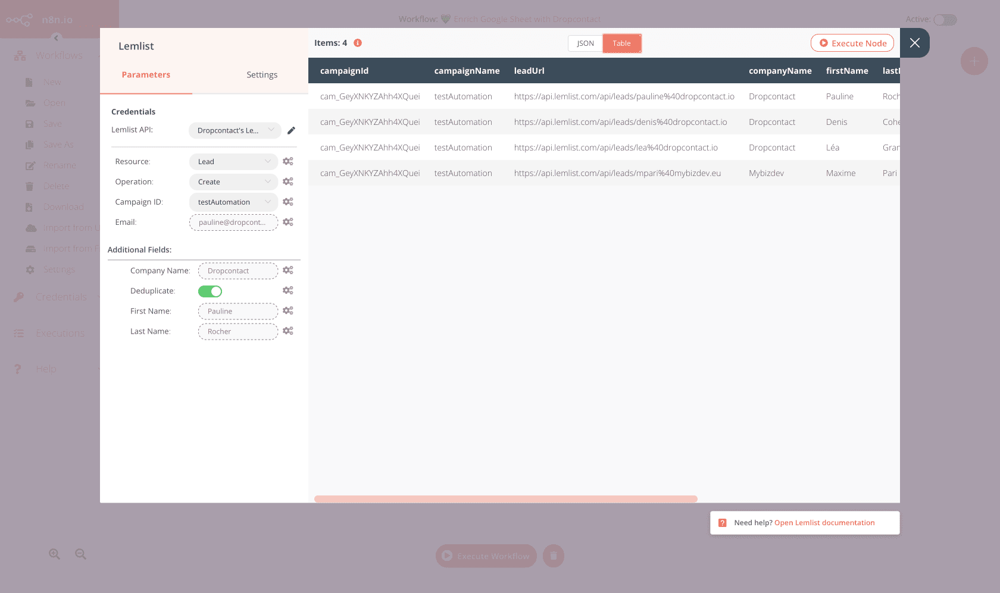

# Dropcontact

[Dropcontact](https://www.dropcpontact.com) is an email finder platform that allows you to automatically find, verify and validate nominative emails and enrich your contacts with all efficient information to contact him.

::: tip 🔑 Credentials
You can find authentication information for this node [here](../../../credentials/Dropcontact/README.md).
:::

## Basic Operations

<Resource node="n8n-nodes-base.dropcontact" />

## Example Usage

This workflow allows you to find email and enrich your contact from a Google Sheet. Dropcontact will enrich your contact data with job title, LinkedIn profile, professional phone number, Company Name, LinkedIn page, business address, legal information...
Dropcontact will also clean and normalize your data information, including gender, name correction, and toxic characters removal...

### 1. Start Node
The start node exists by default when you create a new workflow.

### 2. Google Sheet
This node will list all the records from Google Sheet. Create a table like [this](https://docs.google.com/spreadsheets/d/1jCyGrz01b7wdoujEHHZvw-JD5zszTMFqn8cvvSnLPrE/edit#gid=0) in your Google Drive.

1. First of all, you'll have to enter credentials for the Google Sheet node. You can find out how to do that here.
2. Select the 'Sheet' option from the Ressource dropdown list.
3. Select the 'Read' option from the Operation dropdown list.
4. Enter the Base ID in the Base ID field. Your Google Sheet ID is available in the URL https://docs.google.com/spreadsheets/d/{spreadsheetId}/edit
5. Specify rows where is your data
6. Click on Execute Node to run the node.
In the screenshot below, you will notice that the node returns the information of the leads.

### 3. Dropontact node
This node will find the email address and enrich your contact.
1. First of all, you'll have to enter credentials for the Dropcontact node. You can find out how to do that [here](../../../credentials/Dropcontact/README.md).
2. Select 'Contact' from the Resource dropdown list.
3. For each input field, click on the gears icon next to the field and click on Add Expression.
Select the following in the Variable Selector section: Node > Input Data > JSON > fields > firstName . You can also add the following expression: {{$json["fields"]["firstName"]}}.
4. If your contacts are french, you can choose to enrich with company information
5. Specify in which language you want your output data : French or English
6. You can add additional fields if you have information like LinkedIn URL, SIREN, or if you want to verify and qualify an existing email address.
7. Click on Execute Node to run the node.
The execution takes 45 seconds. This is normal: Dropcontact's algorithms are working in real-time. 😘

In the screenshot below, you will notice that the Dropcontact node has enriched your data.

### 4. lemlist
This node will create new leads for a campaign in Lemlist.

1. First of all, you'll have to enter credentials for the Lemlist node. You can find out how to do that here.
2. Select 'Lead' from the Resource dropdown list.
3. Select a campaign from the Campaign ID dropdown list.
4. Click on the gears icon next to the Email field and click on Add Expression.
5. Select the following in the Variable Selector section: Dropcontact > Input Data > JSON > fields > email.
6. Click on the Add Field button and select 'First Name'.And repeat for 'Last Name' and 'Company'. So, you could personalise your Cold Email sequences 😉
7. Click on the gears icon next to the field and click on Add Expression. Select the right Variable. 

In the screenshot below, you will notice that the node creates new enriched leads in Lemlist.
