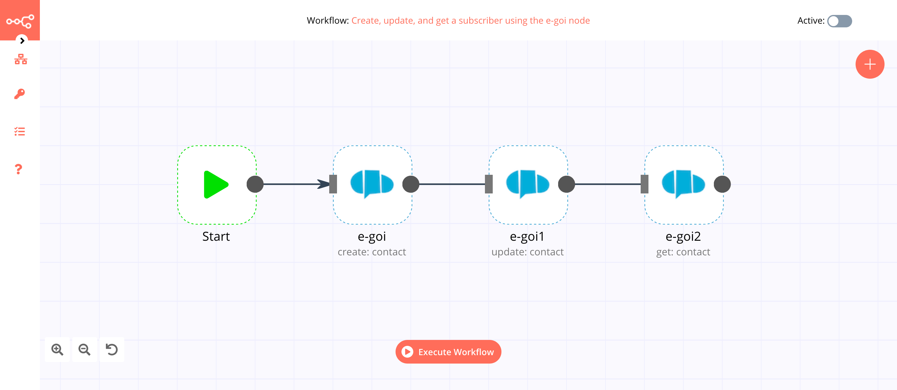
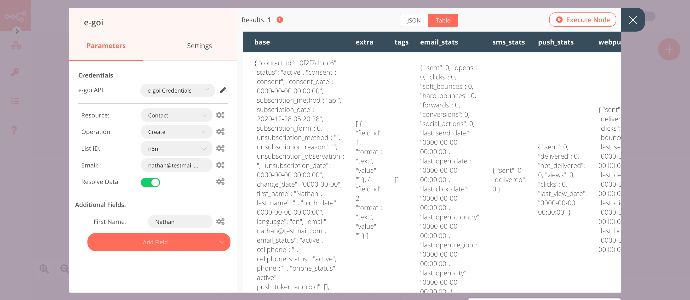
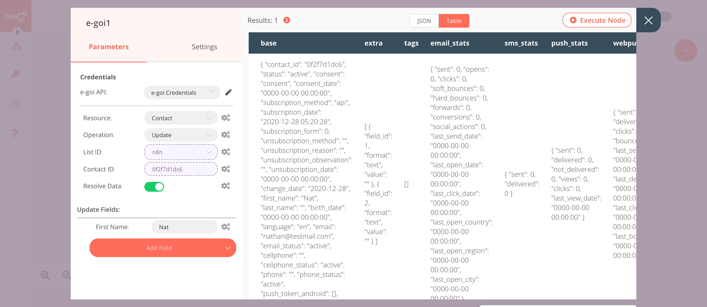

# e-goi

[E-goi](https://www.e-goi.com/) is an omnichannel marketing automation platform.

::: tip 🔑 Credentials
You can find authentication information for this node [here](../../../credentials/Egoi/README.md).
:::

## Basic Operations

::: details Contact
- Create a member
- Get a member
- Get all members
- Update a member
:::

## Example Usage

This workflow allows you to create, update, and get a contact using the e-goi node. You can also find the [workflow](https://n8n.io/workflows/852) on n8n.io. This example usage workflow uses the following nodes.
- [Start](../../core-nodes/Start/README.md)
- [e-goi]()

The final workflow should look like the following image.

### 1. Start node

The Start node exists by default when you create a new workflow.

### 2. e-goi node (create: contact)

This node will create a new contact in e-goi. We will add the first name of the contact along with their email.

1. First of all, you'll have to enter credentials for the e-goi node. You can find out how to do that [here](../../../credentials/Egoi/README.md).
2. Select a list from the ***List ID*** field.
3. Enter the email address in the ***Email*** field.
3. Click on the ***Add Field*** button and select 'First Name' from the dropdown list.
4. Enter the name of the contact in the ***First Name*** field.
5. Click on ***Execute Node*** to run the node.

In the screenshot below, you will notice that the node creates a new contact with their first name and email.

### 3. e-goi1 node (update: contact)

This node will update the information of the contact that we created in the previous node. We will update the first name of the contact using this node.
::: v-pre
1. Select the credentials that you entered in the previous node.
2. Select 'Update' from the ***Operation*** dropdown list.
3. Click on the gears icon next to the ***List ID*** field and click on ***Add Expression***.
4. Select the following in the ***Variable Selector*** section: Nodes > e-goi > Parameters > list. You can also add the following expression: `{{$node["e-goi"].parameter["list"]}}`.
5. Click on the gears icon next to the ***Contact ID*** field and click on ***Add Expression***.
6. Select the following in the ***Variable Selector*** section: Nodes > e-goi > Output Data > JSON > base > contact_id. You can also add the following expression: `{{$node["e-goi"].json["base"]["contact_id"]}}`.
7. Click on the ***Add Field*** button and select 'First Name' from the dropdown list.
8. Enter the first name of the contact in the ***First Name*** field.
9. Click on ***Execute Node*** to run the node.
:::

In the screenshot below, you will notice that the node updates the information of the contact that we created in the previous node. Here, the node has updated the first name of the contact.

### 3. e-goi2 node (get: contact)

This node will return the information of the contact that we created using the e-goi node.

::: v-pre
1. Select the credentials that you entered in the previous node.
2. Select 'Get' from the ***Operation*** dropdown list.
3. Click on the gears icon next to the ***List ID*** field and click on ***Add Expression***.
4. Select the following in the ***Variable Selector*** section: Nodes > e-goi1 > Parameters > list. You can also add the following expression: `{{$node["e-goi1"].parameter["list"]}}`.
5. Click on the gears icon next to the ***Contact ID*** field and click on ***Add Expression***.
6. Select the following in the ***Variable Selector*** section: Nodes > e-goi1 > Output Data > JSON > base > contact_id. You can also add the following expression: `{{$node["e-goi"].json["base"]["contact_id"]}}`.
5. Click on ***Execute Node*** to run the node.
:::

In the screenshot below, you will notice that the node returns the information of the contact that we created using the e-goi node.

